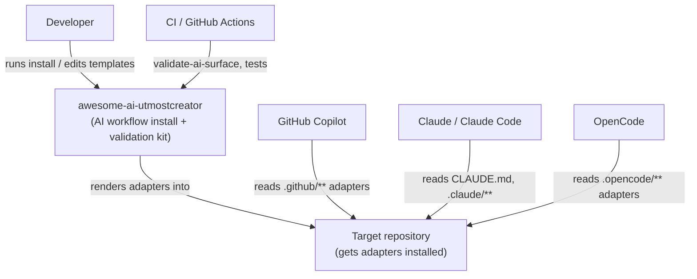
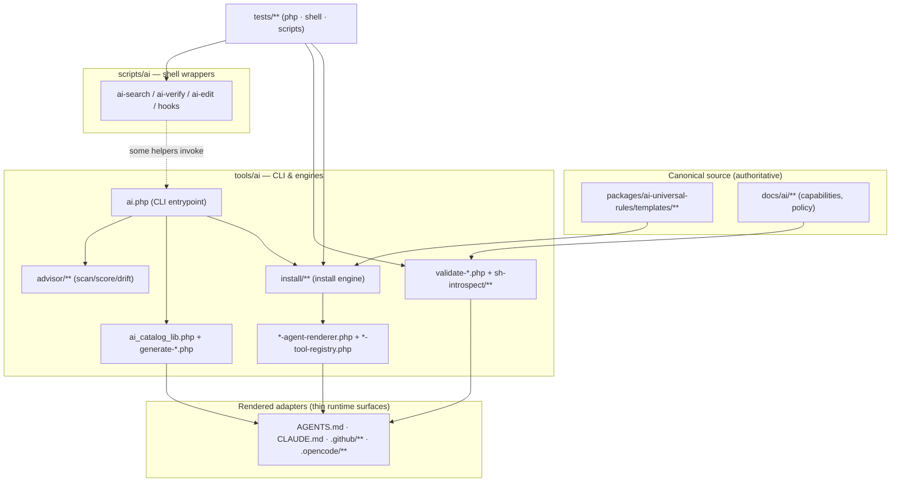
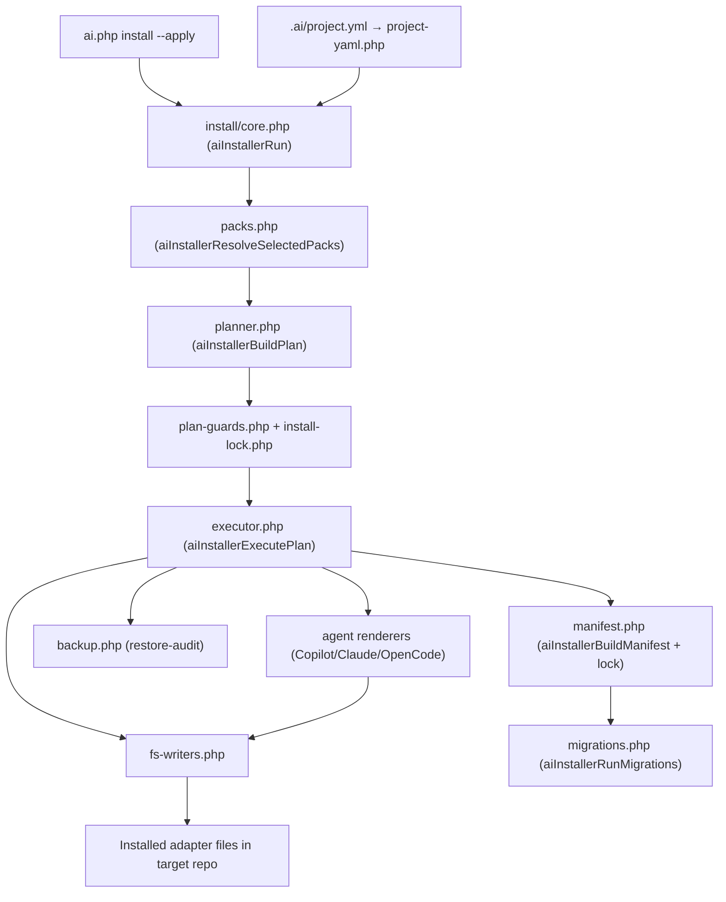
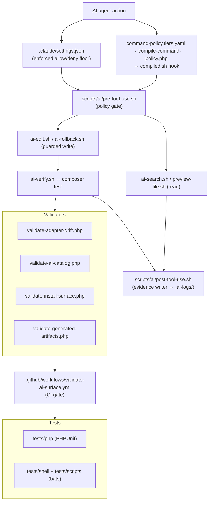
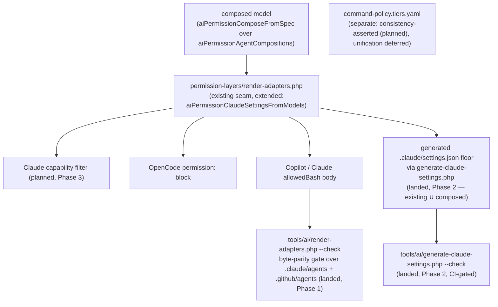

# awesome-ai-utmostcreator — Architecture Diagrams

Multiple small Mermaid diagrams, one concern each, instead of a single "cogged"
mega-graph. Grounded in the graphify knowledge graph (`graphify-out/`, commit
`af500e0c`) plus direct source inspection of `tools/ai/**`, `scripts/ai/**`,
`packages/**`, and `docs/ai/**`.

## Scope and Honesty Notes

- **Own code only.** The graphify graph (105,225 nodes / 201,282 edges / 8,611
  communities) is dominated by vendored tooling under `examples/**/vendor/**`
  (rector, jetbrains phpstorm-stubs, php-standard-library, symfony, league).
  Its top god nodes (`AbstractRector`, `RuleDefinition`, `Self_`, `Container_*`)
  and "surprising connections" are third-party and are **intentionally excluded**
  here — they are not this project's architecture.
- **Excluded paths:** `examples/**`, `vendor/**`, `dist/**`, `graphify-out/**`.
- Each diagram is kept small (≈≤20 nodes) so it renders readably. Diagrams
  cross-reference each other by shared node names.
- Edges reflect `require_once` wiring and documented contracts, not every call.
- **Hand-authored, must sync.** This doc has no `GENERATED` header — it is
  hand-authored and mirrors the architecture as of the named baseline commit
  (see "Regenerating / Updating"). It is registered in
  `docs/ai/source-of-truth.md` as hand-authored-must-sync: it MUST be updated in
  the same change as any render or permission-pipeline change it depicts.
  Sections 4-6 mark not-yet-built elements `(planned)`. Of the originally
  target-state nodes, `render-adapters.php` and its byte-parity gate have
  landed (Phase 1, confirmed present), and `tools/ai/generate-claude-settings.php`
  now exists and generates `permissions.allow`/`permissions.deny` as `existing ∪
  composed floor` — an additive union with the on-disk template rather than a
  pure replacement, deliberately chosen so the generator can never narrow an
  existing allow/deny grant (Phase 2, tracked in plan-28; see that tool's own
  file header for the evidence). The Claude capability filter (Phase 3) and the
  `command-policy.tiers.yaml`-vs-composed-hard-deny consistency assertion (the
  remaining Phase 2 sub-item) remain confirmed absent today.

## 1. System Context

Who and what interacts with the kit.



## 2. Module / Container Map

The eight own-code subsystems and their high-level dependencies.



## 3. Install Pipeline Flow

Verified from `tools/ai/install/core.php` (`aiInstallerRun`) call order:
`aiInstallerResolveSelectedPacks` (L64) → `aiInstallerBuildPlan` (L87) →
`aiInstallerExecutePlan` (L149) → `aiInstallerBuildManifest` (L194) →
`aiInstallerRunMigrations` (L195, terminal step). The interactive wizard
(`commands/install_workflow.php`) additionally uses `selection-engine.php`;
`core.php` on the `--apply` path does not, so it is omitted here.



## 4. Adapter Render Pipeline

Provider-agnostic projection described in `docs/ai/adapter-contract.md`
("canonical source → provider registry → provider renderer → provider output →
validation/drift check"). The canonical agent source is in OpenCode format;
`copilot-agent-renderer.php` is the shared renderer (it also copies the raw
OpenCode agents via `aiInstallerCopyDirAsOpenCodeAgents()`). The `permission:`
YAML block and Copilot/Claude `allowedBash` (the advisory Bash Command Policy
*body*) are projected by the permission seam
`permission-layers/render-adapters.php` (`aiPermissionRenderAdapters()`), not by
`runtime-opencode.sh` (which is a bash runtime copier).

One honesty gap this diagram made explicit is now closed, one remains (target
fixes tracked in
`docs/tickets/claude-agent-fleet-remediation/plan-28-permission-sot-and-render-parity-sync.md`;
see Section 6 for the current-vs-target projection model):

- The **enforced** Claude allow/deny floor is `.claude/settings.json`, union-merged
  by `claude-settings-merge.php` from `templates/claude/settings.json`. That
  template's `permissions.allow`/`permissions.deny` arrays are now generated
  (Phase 2, landed) by `tools/ai/generate-claude-settings.php --check`/`--write`
  from the same `perm` seam (`aiPermissionClaudeSettingsFromModels()`) —
  as `existing ∪ composed floor` (additive union, never a full replacement, so a
  pre-existing hand-curated allow/deny entry can never be silently dropped). The
  `$schema` and `hooks` keys of that template remain hand-authored.
- `generate-agent-permissions.php --check` byte-parity-gates only the narrower
  `permission:` YAML block, and only for OpenCode + the templates. Phase 1 (landed)
  closes the wider gap for the *whole rendered body*: `tools/ai/render-adapters.php
  --check` (CI-gated) byte-parity-gates all of `.claude/agents/*.md` and
  `.github/agents/*.agent.md` against their templates.

```mermaid
graph LR
    canonical["Canonical source<br/>templates/** + docs/ai/**"]
    registry["Provider registry<br/>packs.php + *-tool-registry.php"]

    subgraph Renderers
        cop["copilot-agent-renderer.php<br/>(shared: also copies OpenCode agents)"]
        cla["claude-agent-renderer.php"]
        perm["permission-layers/render-adapters.php<br/>(aiPermissionRenderAdapters — advisory body seam)"]
    end

    subgraph SettingsFloor["Enforced Claude floor (allow/deny generated, Phase 2 landed)"]
        setgen["generate-claude-settings.php<br/>(existing ∪ composed floor)"]
        setmpl["templates/claude/settings.json<br/>(allow/deny generated;<br/>$schema/hooks hand-authored)"]
        setmerge["claude-settings-merge.php"]
        perm -->|composed floor| setgen --> setmpl
    end

    subgraph Outputs
        copout[".github/** (agents, instructions, prompts)"]
        claout["CLAUDE.md · .claude/**"]
        opcout[".opencode/** (agents, commands, skills)"]
        agentsmd["AGENTS.md"]
    end

    drift["validate-adapter-drift.php<br/>generate-agent-permissions.php --check<br/>(permission: block only)"]
    bodygate["render-adapters.php --check<br/>(whole-body byte-parity, CI-gated — Phase 1 landed)"]

    canonical --> registry
    registry --> cop --> copout
    registry --> cla --> claout
    registry --> cop --> opcout
    perm -->|OpenCode permission: block| opcout
    perm -->|allowedBash body| copout
    perm -->|allowedBash body| claout
    setmpl --> setmerge -->|enforced allow/deny floor (generated, Phase 2 landed)| claout
    registry --> agentsmd
    opcout -->|byte-parity gated| drift
    canonical -->|byte-parity gated| drift
    copout --> bodygate
    claout --> bodygate
    agentsmd --> drift
```

## 5. Validation & Tool-Use Hooks

Canonical policy gate (`pre-tool-use.sh`) and evidence writer
(`post-tool-use.sh`) from `AGENTS.md` + `docs/ai/tools/**`, plus the validator
and test surface. This diagram now also shows the **enforcement layer** that
gates agent actions at runtime (the enforced `.claude/settings.json` floor and
the compiled `command-policy` sh hook — the third list from Section 6), plus the
`validate-ai-surface.yml` CI gate. See Section 6 for how these enforcement
surfaces relate to the advisory-body projection.



## 6. Permission Source-of-Truth & Projection Model

The permission enforcement surface is the subject of
`docs/tickets/claude-agent-fleet-remediation/plan-28-permission-sot-and-render-parity-sync.md`.
Plan-28 is the authoritative source for the **target** architecture below;
the **current** diagram matches confirmed file reality. Every node that does not
exist yet is marked `(planned)`. Phase 1 has landed: `tools/ai/render-adapters.php`
now exists and its `--check` is CI-gated (see "Regenerating This Repo's Own
`.claude/agents` And `.github/agents`" in `docs/ai/maintainer-guide.md`) — it
byte-parity-gates the advisory Bash Command Policy body only. Phase 2 has now
landed its generator: `tools/ai/generate-claude-settings.php --check` is
CI-gated too, and generates `.claude/settings.json`'s `permissions.allow`/`deny`
as `existing ∪ composed floor` (additive union, never a full replacement — see
that tool's file header). Still outstanding: the Phase 2
`command-policy.tiers.yaml`-vs-composed-hard-deny consistency assertion, and all
of Phase 3 (the Claude capability filter).

### 6a. Historical baseline (pre-Phase-2; superseded — see 6b for current)

Three unlinked enforcement surfaces, as they stood after Phase 1 landed and
before Phase 2's generator existed. Phase 1 closed the byte-parity gap for
cluster 1's own rendered output (`tools/ai/render-adapters.php --check`, CI-gated).
At this point the defect was the **absence** of any edge between the
advisory-body cluster and the enforced-floor cluster — the enforced floor was
not yet generated from cluster 1. Phase 2 closed this gap (see 6b); this
subsection is kept only as the "before" state for contrast.

```mermaid
graph TD
    subgraph Body["1. Advisory body (composed model)"]
        model1["composed model<br/>(aiPermissionComposeFromSpec)"]
        seam1["permission-layers/render-adapters.php"]
        bodyout["per-agent Bash Command Policy body<br/>(.opencode / .github / .claude — advisory)"]
        bytegate1["tools/ai/render-adapters.php --check<br/>(CI-gated byte-parity — Phase 1 landed)"]
        model1 --> seam1 --> bodyout --> bytegate1
    end

    subgraph Floor["2. Enforced floor (hand-maintained)"]
        settmpl1["templates/claude/settings.json<br/>(static, hand-maintained)"]
        setmerge1["claude-settings-merge.php"]
        floorout[".claude/settings.json<br/>(enforced allow/deny floor)"]
        settmpl1 --> setmerge1 --> floorout
    end

    subgraph Hook["3. Compiled sh hook"]
        tiers1["command-policy.tiers.yaml"]
        compile1["compile-command-policy.php"]
        hookout["compiled sh hook"]
        tiers1 --> compile1 --> hookout
    end

    redflag["RED FLAG (Phase 2, unbuilt): no edge links<br/>cluster 1 and cluster 2 — enforced floor still hand-maintained"]
```



### 6b. Target (Phase 1 + Phase 2 generator landed; Phase 3 + tiers.yaml consistency assertion planned — see plan-28)

One composed model fans out to N projections, including a **generated** (additive
union with the existing template — never a full replacement) settings floor; a
byte-parity gate spans `.claude/agents` + `.github/agents` (landed, Phase 1).
`command-policy.tiers.yaml` stays a deliberately separate node
("consistency-asserted, unification deferred") — the consistency assertion
itself is still outstanding (Phase 2 sub-item). No second registry.



## Regenerating / Updating

- **Maintenance rule:** this doc is hand-authored (no `GENERATED` header) and
  mirrors the architecture as of baseline commit `af500e0c` (graph) plus the
  permission-pipeline state at the time of writing. It MUST be updated in the
  same change as any render or permission-pipeline change it depicts, and it is
  registered in `docs/ai/source-of-truth.md` as hand-authored-must-sync. A
  forward file-existence test (`tests/php/ArchitectureDiagramReferencesTest.php`)
  asserts that own-code paths named in the diagrams still resolve.
- **Planned → current flip (follow-up, tied to plan-28):** Phase 1 has landed and
  its markers are flipped (`tools/ai/render-adapters.php` exists; its exemption is
  removed from `ArchitectureDiagramReferencesTest.php`, which now asserts the path
  exists). Phase 2's generator has also landed and its marker is flipped
  (`tools/ai/generate-claude-settings.php` exists and generates `existing ∪
  composed floor`; its exemption is likewise removed from
  `ArchitectureDiagramReferencesTest.php`). Still outstanding: the Phase 2
  `command-policy.tiers.yaml`-vs-composed-hard-deny consistency assertion (see
  Section 6b's `tiers2` node), and all of Phase 3 (the Claude capability filter,
  `capfilter` in Section 6b) — when those land, flip their remaining `(planned)`
  markers and remove the now-stale Section 4/6a "known gap" framing (6a is
  already reframed as a historical baseline, not current state).
- Refresh the underlying graph after code changes: `graphify update .`
- Re-query a subsystem before editing a diagram, e.g.
  `graphify query "How does the install executor call the agent renderers?"`
- Keep diagrams own-code only; if you must show vendored tooling, collapse
  `examples/**/vendor/**` into a single node labelled "Vendored tooling".
