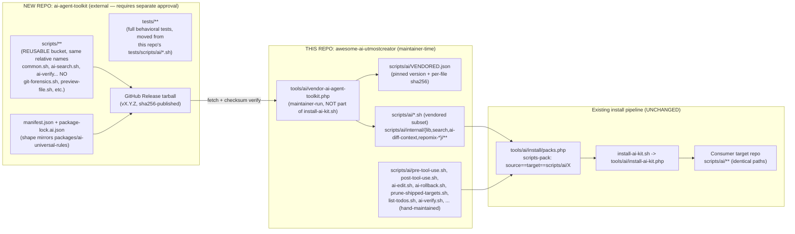
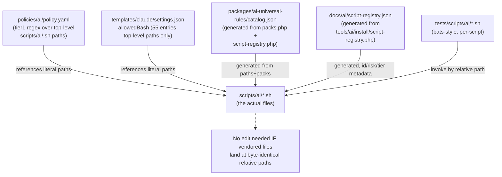

# Architecture Plan: Extract Reusable `scripts/ai/**` Subset into a New Published CLI Package

## Instruction Specificity

Score: **78/100**. Target (this repo's `scripts/ai/**`), outcome (bounded extraction + this-repo integration design), and most boundaries are explicit and pre-researched by the user. Deductions: (1) packaging channel is explicitly left to me to justify — resolved below; (2) "install-ai-kit.sh pulls a pinned version... before the existing copy-to-target step" is ambiguous between _runtime-per-install fetch_ and _maintainer-time vendor-update_ — I resolve this explicitly with justification rather than asking, since the tradeoff is evidence-backed and low-ambiguity once the existing pipeline is understood; (3) exact classification of a handful of borderline-named scripts (`ai-install-coverage.sh`, `session-checkpoint.sh`, `sh-introspect.sh`) rests on MANIFEST.md role labels rather than full source reads — flagged as assumptions, not asserted as verified fact.

## Extracted User Intent

Split `scripts/ai/**` into: (a) a new, separately published, installable CLI package containing only scripts whose value does not depend on this repo's install/policy/catalog pipeline, and (b) scripts that stay because they exist specifically to enforce or emit this kit's own governance model. Produce a bounded plan for both sides plus the integration seam, without inventing behavior not evidenced in the repo, and without editing files (architect is read-only; a real implementation plan file is produced by `architecture-plan-writer` next).

## User-Stated Acceptance Criteria

- Explicit, testable extraction criteria distinguishing REUSABLE / KIT-SPECIFIC / BORDERLINE.
- Every top-level `scripts/ai/*.sh` (49 confirmed) plus `scripts/ai/internal/**` module tree classified.
- Package shape decided and justified (name, distribution channel, manifest/lock shape) against multi-language target support and `install-ai-kit.sh`'s curl-and-run philosophy.
- Confirm/refute that the extracted package installs at a `scripts/ai/`-equivalent relative path so this repo's own path assumptions keep working, or justify an alternative with every coupling point updated.
- This-repo integration design: fetch/vendor mechanism, catalog.json impact, `tests/scripts/ai/*.sh` fate, and confirmation of whether `policies/ai/policy.yaml`/adapter `settings.json` need edits.
- Staged, independently verifiable implementation plan with real verification commands, explicit risk classification, and approval flags per this repo's own approval-boundary rules.
- No invented behavior; state assumptions and open questions.

## Inferred Acceptance Criteria

- The classification must be reusable as a _policy_, not a one-off judgment call — i.e., a future new script must be classifiable by the same test.
- The new package's own manifest/lock must mirror the _shape_ of `packages/ai-universal-rules/manifest.json` + `package-lock.ai.json`, not literally reuse those files (stated by user, but also required for the plan-writer output to be self-consistent with this repo's own precedent).
- Because creating and publishing a brand-new external repository is itself an external-project action, that step must be flagged as requiring separate explicit human approval per `AGENTS.md`'s External Project Context Policy — the architect cannot approve or perform it.
- Because several `scripts/ai/*.sh` are on this repo's own security-policy allowlist (`policies/ai/policy.yaml`) and Claude/OpenCode `allowedBash` lists, any chunk that bulk-overwrites those live files is inherently medium/high risk and needs explicit approval, even though the end-state paths are unchanged.

## Negative Acceptance Criteria

- Must **not** rename or relocate any currently-shipped `scripts/ai/<name>.sh` path — `policies/ai/policy.yaml`, `templates/claude/settings.json`, `templates/opencode/**`, and `tests/scripts/ai/*.sh` all hardcode literal `scripts/ai/<name>.sh` strings; any rename is a breaking change to the security-policy surface.
- Must **not** force a JS/PHP-specific runtime (npm/Composer) as the _required_ install mechanism for the new package, since this kit targets 11+ language stacks (`packages/ai-universal-rules/stacks/*.json`: python, ruby, go, php, java, js-ts, dotnet, rust, shell, make, github-actions).
- Must **not** silently widen `policies/ai/policy.yaml` allow/confirm/deny rules or `allowedBash` permission lists as a side effect of vendoring — the confirmed classification shows these files need **zero** edits if paths stay identical (verified below), so any edit to them in a later chunk should be treated as a scope-creep flag, not a normal side effect.
- Must **not** move `pre-tool-use.sh`, `post-tool-use.sh`, `ai-edit.sh`/`ai-rollback.sh`, `prune-shipped-targets.sh`, or `list-todos.sh` — these directly consume `policies/ai/policy.yaml`, `.ai-install-manifest.json`, this kit's snapshot/evidence contract, or the `docs/tickets/**/plan*.md` convention.
- Must **not** perform the actual external-repo creation/publish (Chunk 4 below) without a separate, explicit, named approval — this plan documents _what_ that repo must contain, not permission to create it.

## Relevant Evidence

- `scripts/ai/MANIFEST.md` (this repo) — authoritative current inventory: 49 top-level public/facade scripts with target role (`context|verify|edit|read|admin|hooks|internal-lib`) and risk (`read-only|mutating`), plus 26 `internal/lib/**` + `internal/search/**` private modules, and a documented P4 "generated `bin/<role>/` delegating shim" tree that must not be hand-edited.
- `docs/ai/script-registry.json` (schema_version 1.1.0, 1039 lines) — per-script `risk`, `autonomy_level`, `profiles`, `mutates_state`, `requires_approval`, `supports_dry_run`, `required_tools`, `writes_paths`; generated from `tools/ai/install/script-registry.php` (single source of truth).
- `policies/ai/policy.yaml` (root, byte-for-byte duplicated at `packages/ai-universal-rules/policies/ai/policy.yaml` per user's confirmed context) — hardcoded regex `tier1-read-only-scripts` / `tier1-generated-output-scripts` / `tier1-ai-edit-dryrun` / `tier1-ai-rollback-read` / `tier1-repomix-read` patterns keyed to literal `scripts/ai/<name>.sh` paths. **Only `pre-tool-use.sh` (line 40) reads this file at runtime** — confirmed via repo-wide grep; no other script depends on it, which is the key evidence enabling zero-touch vendoring.
- `packages/ai-universal-rules/templates/claude/settings.json` — 55 `allowedBash` entries, all keyed to literal top-level `scripts/ai/<name>.sh` paths; **zero references to `scripts/ai/internal/**`\*\* (internal modules are only sourced, never directly invoked, so they need no permission entries of their own).
- `tools/ai/install/packs.php` (`scripts-pack` entry, lines ~224-286) — the actual copy mechanism `install-ai-kit.sh` triggers (via `tools/ai/install-ai-kit.php`), confirming: `common.sh`, `internal/` (whole dir), `bin/` (whole dir), and every named top-level script are copied 1:1 from `source: scripts/ai/X` to `target: scripts/ai/X` in the target repo. **`install-ai-kit.sh` itself does not loop over files directly** — it shells out to `tools/ai/install-ai-kit.php`, which reads this pack table. (Correction to the user's confirmed-context wording, which described this at a slight remove — the copy is pack-driven, not a literal shell copy loop, but the practical effect — this repo's own working tree is the install source — is unchanged.)
- `tools/ai/install/permission-layers/script-tiers.php` — turns `script-registry.php` entries into 5 permission tiers (`ai-read`, `ai-context-ask`, `ai-verify`, `ai-write`, `ai-deny-dangerous`); explicitly notes per-agent variation is handled as exceptions, not tier membership — reusable lens for "safe default access level," not for kit-specificity itself.
- `scripts/ai/internal/lib/50-policy.sh` — **confirmed self-contained**: a hardcoded shell `case` statement for command classification (`classify_command`, `enforce_command_policy`). It does **not** read `policies/ai/policy.yaml`. This proves `common.sh` + all of `internal/lib/**` (12 modules + `exec-guard/` 4 submodules) has **no runtime coupling** to this kit's policy file — it is a genuinely portable bash "agent shell stdlib" (env, core, json, paths, logging, log-redaction, session, policy-classification, exec-guard/timeout, secrets-redaction, token-counting, snapshot).
- `scripts/ai/internal/ai-verify/90-run.sh` (419 lines, read in full) — **confirmed mostly generic**: presence-driven dispatch over shellcheck/shfmt/actionlint, `composer.json` → pint/phpstan/psalm/phpunit/pest/deptrac, `package.json` → pnpm/npm lint/typecheck/test/playwright/vitest, gitleaks/trivy/semgrep/osv-scanner. Two embedded kit-specific calls: `check_plan_status` (Todo-checklist guardrail over `docs/tickets/**/plan*.md`) and `is_ai_kit_source_repo`/`all_php_files_excluding_shipped` (in `20-shipped-filters.sh`, detects `packages/ai-universal-rules/templates` + `package-lock.ai.json` to exclude "shipped" files from lint in installed targets) — both are this kit's own conventions, not generic verification behavior.
- `scripts/ai/ai-task.sh` (read, lines 1-40) — generic project-command discovery (`package.json` scripts, package-manager detection) with no kit-specific path references; its `ai-deny-dangerous` tier membership (in `script-tiers.php`) reflects that it _executes_ discovered commands (mutation risk), not kit-specificity.
- `scripts/ai/prune-shipped-targets.sh` (header, lines 4-5) — explicit: "Read `.ai-install-manifest.json` and operate on the kit-author's local copies of files installed from `packages/ai-universal-rules/templates/**`" — unambiguously kit-author-only.
- `scripts/ai/list-todos.sh` — explicit: scans `docs/tickets/**/plan*.md` for this kit's own Todo Plan/Acceptance Criteria checklist convention, including the `archive/DONE-<name>` convention documented in `docs/tickets/README.md`.
- `packages/ai-universal-rules/manifest.json` / `package-lock.ai.json` — precedent shape: `manifest.json` has `name`, `version` (semver), `description`, `required_templates`, `generated_outputs`, `release.{export_root,bundle_prefix,notes,max_bundle_lines}`; `package-lock.ai.json` has `schema_version`, `package`, `source_checksums: {path: "sha256:<hex>"}` per shipped file.
- `packages/ai-universal-rules/stacks/*.json` — 11 stack files (github-actions, python, ruby, go, markdown, shell, dotnet, make, rust, php, java, js-ts) confirming genuine multi-language target support, which rules out a hard npm/Composer runtime dependency for the extracted package.
- `install-ai-kit.sh` (full read, 306 lines) — confirms the "curl-and-run" philosophy: it is itself invoked directly (`curl ... | bash` or `bash install-ai-kit.sh <target>`), checks `php/composer/git/jq` as prerequisites, and never performs any network fetch of `scripts/ai/**` content — everything is copied from `$SCRIPT_DIR` (this repo's own tree).
- `tests/scripts/ai/*.sh` — 36 bats-style test files (confirmed via glob), one per script/topic, plus `run-all-tests.sh` — the harness `docs/ai/execution-protocol.md` names as `bash tests/scripts/ai/run-all-tests.sh` (360s budget).

## Extraction Criteria (Generalizable Test)

A script (or its private `internal/<name>/**` module tree) is:

- **REUSABLE** iff, reading its source, it does **not** reference: `policies/ai/policy.yaml`, `.ai-install-manifest.json`, `.ai/catalog.json`, `packages/ai-universal-rules/**`, `docs/tickets/**` plan-file conventions, or `is_ai_kit_source_repo`-style "am I the kit's own source repo" detection — i.e., it would behave identically if dropped into an unrelated repo with no knowledge of this kit's install/policy/catalog model. Confirmed by direct source grep, not by name alone, wherever stated below.
- **KIT-SPECIFIC** iff it exists specifically to read, write, or enforce one of those kit-owned artifacts/conventions — removing this kit's install/policy model would make the script meaningless.
- **BORDERLINE** iff the _mechanism_ is generic but a _subset_ of its behavior is a kit-owned convention grafted onto an otherwise portable engine — the decision is whether to hookify (extract engine, kit-specific behavior becomes an optional plugin) or keep the whole thing local until that refactor is worth doing on its own.

## Script Classification Table

Confidence: **[confirmed]** = source read/grepped directly this session; **[inferred]** = MANIFEST.md role/name only, not independently source-verified — flagged as an assumption for chunk-1 verification.

### REUSABLE — candidates for extraction

| Script                                                                                                                                                                                                                                                                                                                        | Rationale                                                                                                                                                                                                                                                                                                                                                     |
| ----------------------------------------------------------------------------------------------------------------------------------------------------------------------------------------------------------------------------------------------------------------------------------------------------------------------------- | ------------------------------------------------------------------------------------------------------------------------------------------------------------------------------------------------------------------------------------------------------------------------------------------------------------------------------------------------------------- |
| `common.sh` + `internal/lib/{00-env,05-core,10-json,20-paths,30-logging,31-log-redaction,40-session,50-policy,60-exec-guard,70-secrets,80-tokens,90-snapshot}.sh` + `internal/lib/exec-guard/*.sh`                                                                                                                            | **[confirmed]** `50-policy.sh` proven self-contained (no `policy.yaml` read); shared bash stdlib (env/logging/json/paths/session/secrets-redaction/token-count/timeout-guard) with no kit-specific paths anywhere in the facade contract. Used by _every_ script including kit-specific ones — extraction makes it a shared dependency, not a duplicated one. |
| `ai-search.sh`, `ai-search-multi.sh`, `ai-search-introspect.sh` + `internal/search/**` (18 modules)                                                                                                                                                                                                                           | **[confirmed]** generic rg/fd/git/ast-grep search facade; `policies/ai/policy.yaml`/`settings.json` grep confirms only top-level paths are policy-referenced, `50-policy.sh` confirms no policy-file read inside the tool itself.                                                                                                                             |
| `ai-diff-context.sh` + `internal/ai-diff-context/{10-helpers,40-commands,90-main}.sh`                                                                                                                                                                                                                                         | **[inferred]** generic diff-aware context extraction (git diff analysis), no kit-path references found in top-level grep sweep.                                                                                                                                                                                                                               |
| `rg-code.sh`, `fd-files.sh`                                                                                                                                                                                                                                                                                                   | **[confirmed]** thin generic search wrappers, `required_tools` in registry are `rg`/`fd` only.                                                                                                                                                                                                                                                                |
| `preview-file.sh`                                                                                                                                                                                                                                                                                                             | **[confirmed]** generic safe file preview with binary/secret-glob guards; no kit-path coupling.                                                                                                                                                                                                                                                               |
| `git-forensics.sh`, `git-branch-origin.sh`                                                                                                                                                                                                                                                                                    | **[inferred]** generic read-only git history tools, `git`-only required tool per registry.                                                                                                                                                                                                                                                                    |
| `gh-pr-context.sh`                                                                                                                                                                                                                                                                                                            | **[inferred]** generic `gh` CLI PR-context wrapper.                                                                                                                                                                                                                                                                                                           |
| `query-usage.sh`                                                                                                                                                                                                                                                                                                              | **[confirmed]** generic token/usage estimator.                                                                                                                                                                                                                                                                                                                |
| `repo-stats.sh`, `repo-tool-inventory.sh`                                                                                                                                                                                                                                                                                     | **[inferred]** generic repo statistics / installed-CLI-tool inventory.                                                                                                                                                                                                                                                                                        |
| `ai-file-freshness.sh`                                                                                                                                                                                                                                                                                                        | **[inferred]** generic file-freshness inspection.                                                                                                                                                                                                                                                                                                             |
| `check-file-refs.sh`                                                                                                                                                                                                                                                                                                          | **[inferred]** generic file-reference validator, parameterized by path args (used generically in `install-ai-kit.sh`-style calls elsewhere).                                                                                                                                                                                                                  |
| `ai-doc-check.sh`                                                                                                                                                                                                                                                                                                             | **[confirmed via `install-ai-kit.sh` usage]** invoked as `ai-doc-check.sh markdownlint docs/ai .github ...` — fully parameterized by path args, not hardcoded to kit doc paths.                                                                                                                                                                               |
| `ai-test-select.sh`, `run-test-focused.sh`, `run-repo-tests.sh`                                                                                                                                                                                                                                                               | **[inferred]** generic language/framework-detecting test-selection and runner heuristics — explicitly named by the user's own context as reusable-example scripts.                                                                                                                                                                                            |
| `pack-context.sh`, `repomix-context-tree.sh`, `repomix-scc-router.sh` (+ `internal/repomix-scc-router/**`), `repomix-context-tree` (+ `internal/repomix-context-tree/**`), `repomix-freshness.sh`, `repomix-ensure-fresh.sh`, `run-repomix-context.sh`, `run-repomix-file.sh` (+ `internal/repomix-shared/10-common-opts.sh`) | **[inferred]** generic repomix wrappers — useful in any repo with `repomix`/`scc` installed; no catalog/manifest coupling found.                                                                                                                                                                                                                              |
| `ai-structured.sh`                                                                                                                                                                                                                                                                                                            | **[inferred]** generic structured evidence/context helper (task/JSON packaging), no kit-path references found.                                                                                                                                                                                                                                                |
| `watch-loop.sh`                                                                                                                                                                                                                                                                                                               | **[inferred]** generic long-running file-watch trigger loop.                                                                                                                                                                                                                                                                                                  |

### KIT-SPECIFIC — must stay

| Script                                                                                             | Rationale                                                                                                                                                                                                                  |
| -------------------------------------------------------------------------------------------------- | -------------------------------------------------------------------------------------------------------------------------------------------------------------------------------------------------------------------------- |
| `pre-tool-use.sh` + `internal/pre-tool-use/{10-helpers,20-decide}.sh`                              | **[confirmed]** the _only_ script reading `policies/ai/policy.yaml` (line 40) — this kit's own runtime security gate.                                                                                                      |
| `post-tool-use.sh`                                                                                 | **[inferred, high confidence]** MANIFEST-documented as "post-tool evidence/runtime hook" — the counterpart evidence-emission half of the pre/post hook pair; emits this kit's `.ai-logs` evidence-event schema.            |
| `ai-edit.sh`, `ai-rollback.sh` + `internal/ai-edit/{10-helpers,30-parse,40-plan-apply,90-main}.sh` | **[inferred]** MANIFEST: "guarded" edit/rollback tightly bound to `internal/lib/90-snapshot.sh`'s snapshot/evidence contract — this kit's own governance model for AI-driven edits, not a generic patch tool.              |
| `prune-shipped-targets.sh` + `internal/prune-shipped-targets/{10-rules,60-apply,90-run}.sh`        | **[confirmed]** header explicitly reads `.ai-install-manifest.json` and operates on `packages/ai-universal-rules/templates/**` copies — kit-author-only maintenance.                                                       |
| `list-todos.sh`                                                                                    | **[confirmed]** scans `docs/tickets/**/plan*.md` for this kit's own Todo Plan/Acceptance Criteria + `archive/DONE-<name>` convention.                                                                                      |
| `all_in_one.sh`                                                                                    | **[inferred]** MANIFEST: "administrative all-in-one workflow," not registry-listed; admin-role scripts in this kit orchestrate the install/verify/catalog pipeline end-to-end.                                             |
| `build-ai-help-bundle.sh`                                                                          | **[inferred]** MANIFEST: "help bundle build helper," not registry-listed; builds this kit's own `llms.txt`/help artifacts from its own docs/catalog.                                                                       |
| `ai-install-coverage.sh`                                                                           | **[inferred]** "install coverage verification" — reads as checking _this kit's own_ install-surface coverage against its manifest/catalog, not a generic tool.                                                             |
| `ship-audit.sh`                                                                                    | **[confirmed]** reads a forbidden-path config list (`docs/ai/generated docs/tickets .ai-logs vendor dist node_modules`) and audits this kit's own shipped installer packs — meaningless outside this kit's shipping model. |

### BORDERLINE — explicit decision required

| Script                                                                                                                     | Mechanism vs. kit-specific behavior                                                                                                                                                                                                                                                                                                                                                                  | Decision                                                                                                                                                                                                                                                                                                                                                                                                                                                                                    |
| -------------------------------------------------------------------------------------------------------------------------- | ---------------------------------------------------------------------------------------------------------------------------------------------------------------------------------------------------------------------------------------------------------------------------------------------------------------------------------------------------------------------------------------------------- | ------------------------------------------------------------------------------------------------------------------------------------------------------------------------------------------------------------------------------------------------------------------------------------------------------------------------------------------------------------------------------------------------------------------------------------------------------------------------------------------- |
| `ai-verify.sh` + 5 thin per-language wrappers (`ai-verify-{html,js,php,ts,vue}.sh`) + `internal/ai-verify/**` (14 modules) | **[confirmed]** `90-run.sh` (419 lines, read in full) is ~90% generic presence-driven language dispatch (shellcheck/shfmt/actionlint/pint/phpstan/psalm/phpunit/pest/pnpm-npm/gitleaks/trivy/semgrep/osv-scanner). Two kit-specific calls are grafted in: `check_plan_status` (docs/tickets Todo-checklist guardrail) and `is_ai_kit_source_repo`/shipped-file exclusion in `20-shipped-filters.sh`. | **Stay in this repo for v1.** Extracting a half-generic tool that silently assumes a `docs/tickets` convention when installed standalone into an unrelated project is worse than not extracting it. Flag as a **fast-follow** candidate once `check_plan_status` and the shipped-file-exclusion logic are refactored into optional, env/config-gated plugin hooks the generic engine calls only if present — that refactor is itself a separate bounded slice, not part of this extraction. |
| `install-mandatory-tools.sh`                                                                                               | **[inferred]** mechanism (detect OS package manager, install missing CLI tools) is generic; the specific "mandatory tools" list (rg/fd/jq/php/composer/git, per `install-ai-kit.sh`'s own prerequisite check) is this kit's own toolchain curation.                                                                                                                                                  | **Stay in this repo for v1.** A generic project would want a different tool list; extracting the mechanism with an externally-supplied list is a real but lower-priority fast-follow, not worth the added indirection for this slice.                                                                                                                                                                                                                                                       |
| `session-checkpoint.sh`                                                                                                    | **[inferred]** MANIFEST: "session continuity snapshot," mutating hook. Uses `internal/lib/40-session.sh` (which is itself REUSABLE), but the checkpoint schema/consumer contract was not independently source-verified this session.                                                                                                                                                                 | **Stay in this repo for v1**, pending source verification in Chunk 1 — insufficient evidence gathered to safely extract; do not guess.                                                                                                                                                                                                                                                                                                                                                      |
| `sh-introspect.sh`                                                                                                         | **[confirmed via MANIFEST P4]** generic mechanism (scans shell scripts for shebang/usage), but its primary documented purpose is validating **this kit's own** `bin/<role>/` shim byte-identity contract (P4/P5 migration) and `script-registry.php` parity — a kit-internal consistency tool, not a general-purpose script indexer in practice.                                                     | **Stay in this repo.** Its value is intrinsically tied to this kit's generated-shim contract.                                                                                                                                                                                                                                                                                                                                                                                               |

**Internal module inheritance rule** (applied above, not separately tabulated): `internal/<name>/**` inherits the classification of the single top-level facade that sources it (`ai-search.sh` → `internal/search/**`; `ai-verify.sh` → `internal/ai-verify/**`; `pre-tool-use.sh` → `internal/pre-tool-use/**`; `ai-edit.sh`/`ai-rollback.sh` → `internal/ai-edit/**`; `prune-shipped-targets.sh` → `internal/prune-shipped-targets/**`; repomix scripts → `internal/repomix-{scc-router,context-tree,shared}/**`; `ai-diff-context.sh` → `internal/ai-diff-context/**`). `internal/lib/**` is the one exception — it is sourced by _every_ script (including kit-specific ones) via `common.sh`, so it is extracted as a shared dependency that kit-specific scripts continue to consume post-extraction, unchanged in behavior.

`scripts/ai/bin/**` (the generated P4 role/risk shim tree) is **out of scope for this extraction** — per `MANIFEST.md`, these are derived, byte-identical `exec` shims regenerated from canonical root paths; the existing generator is agnostic to whether the canonical file is vendored or hand-authored, so it needs no change.

## Target Repo Design

**Confirm/refute install-path design (context point 5): CONFIRMED.** The extracted package must install at a `scripts/ai/`-equivalent relative path inside _this repo's own working tree_ (not a global-PATH binary, not a differently-named subdirectory), because `policy.yaml` and `settings.json` both hardcode literal `scripts/ai/<name>.sh` strings and neither references `internal/**` subpaths directly (confirmed via full-file grep of both). As long as the vendored files land at their exact current relative paths, **zero edits** are required to `policies/ai/policy.yaml`, `packages/ai-universal-rules/policies/ai/policy.yaml`, or `templates/claude/settings.json` (and by the same logic, the equivalent OpenCode/Copilot `allowedBash` renderer outputs). This is the single design constraint that makes the whole extraction low-risk on the security-policy surface.

**Package name:** `ai-agent-toolkit` (retain the user's working name — it is directly descriptive of the actual content: a portable toolkit of CLI scripts for AI coding agents, with no implication that it runs models itself, and it is already the name the user anchored on).

**Distribution channel: GitHub Releases tarball (primary), not npm or Composer.** Justification against the two stated constraints:

- (a) Multi-language target support: this kit installs into PHP, Python, Ruby, Go, Rust, Java, JS/TS, .NET, and shell-only projects (11 confirmed stack files). Requiring `npm install` or `composer require` as the _only_ distribution path would force an unrelated language runtime onto e.g. a pure-Go or pure-Rust target, which directly contradicts the kit's own multi-stack design. A tarball of bash scripts has no runtime dependency beyond `bash`+`tar`+`curl`, which `install-ai-kit.sh` already assumes.
- (b) `install-ai-kit.sh`'s existing curl-and-run philosophy: it already does prerequisite checks (`php composer git jq`) and shells straight into PHP tooling with no package-manager indirection. A GitHub Release tarball, fetched with `curl`, checksum-verified, and extracted with `tar`, is the same operational shape at one more layer of indirection (kit-repo vendors a dependency), not a new one.
- npm is **not excluded as a future secondary channel** (e.g. `npx ai-agent-toolkit` for JS-heavy teams who want it standalone) — but it must never be the _only_ path, and is out of scope for this extraction's v1.

**Manifest/lock shape** (mirrors `packages/ai-universal-rules/manifest.json` + `package-lock.ai.json` shape, not literal reuse):

- `manifest.json`: `name: "ai-agent-toolkit"`, `version` (semver), `description`, `supported_shells: ["bash>=4"]`, `required_tools` (baseline `bash,git,jq`; per-script `optional_tools` mirrored from this repo's `script-registry.json`), `scripts: [<list of shipped relative paths>]`, `release: {export_root, bundle_prefix, notes}`.
- `package-lock.ai.json`-shaped lock: `schema_version`, `package`, `source_checksums: {"<relative path>": "sha256:<hex>", ...}` for every shipped file — this is what `tools/ai/vendor-ai-agent-toolkit.php` (this repo) verifies against before overwriting anything.
- Tests: the full behavioral `tests/scripts/ai/test-*.sh` files for every REUSABLE script **move** to the new repo (see integration design below) and run in that repo's own CI.

## This-Repo Integration Design

**Fetch/vendor mechanism — maintainer-time, not consumer-runtime.** The pinned-version fetch happens as a **new, explicit, maintainer-only step** (`tools/ai/vendor-ai-agent-toolkit.php`, run manually or in a scheduled CI job in _this_ repo, never as part of a consumer's `bash install-ai-kit.sh <target>` invocation). It:

1. Reads a pin from a new `scripts/ai/VENDORED.json` (version + expected sha256 per vendored file).
2. Fetches the GitHub Release tarball for that pinned version via `curl`.
3. Verifies the tarball's sha256 against the pin — **fails closed** on mismatch (supply-chain integrity gate).
4. Extracts and overwrites exactly the vendored relative paths inside this repo's own `scripts/ai/**` working tree.
5. Updates `scripts/ai/VENDORED.json` with the new pin + per-file checksums.
6. Leaves the result as an uncommitted `git diff` for human review before commit.

**Why maintainer-time, not runtime-per-install:** `install-ai-kit.sh` already just copies _this repo's own tracked working tree_ into targets via `packs.php` (`tools/ai/install-ai-kit.php`), with zero network calls for `scripts/ai/**` content today. Making every consumer's install fetch a second remote artifact would (a) add a new runtime network dependency and failure mode to every install, breaking today's offline-repeatable installs, (b) contradict the "curl-and-run, then everything else is local" philosophy the installer already embodies, and (c) mean two different trust boundaries (this repo's git history vs. a second live remote) get merged into one install run, complicating rollback. Vendoring once, at this repo's own release-prep time, keeps `install-ai-kit.sh` and `packs.php` **completely unchanged** — they still just copy this repo's own tracked tree, whatever its provenance.

**`packages/ai-universal-rules/catalog.json` generation:** **No structural change needed.** It is generated by `php tools/ai/generate-ai-catalog.php --check` from `packs.php` pack membership + `script-registry.php` entries; since paths and pack membership are unchanged by vendoring (same files, same names, new provenance), regeneration should produce a byte-identical result. Verify this explicitly with `--check` rather than assuming it (flagged in Chunk 7).

**`tests/scripts/ai/*.sh` fate — MOVE full behavioral tests to the new repo, replace with a thin integrity smoke test here.** Standard "vendor a dependency" pattern: source of truth and its behavioral tests move together. This repo keeps a new, small `test-vendored-scripts.sh` (or extends `test-common-source.sh`) that only checks: each vendored path exists, is executable, matches its pinned sha256 in `scripts/ai/VENDORED.json`, and responds to `--help`/`--introspect` with exit 0 — i.e., proves the _vendoring integrity_, not the tool's internal correctness (that's the new repo's CI's job). KIT-SPECIFIC scripts' existing test files (`test-pre-tool-use.sh`, `test-post-tool-use.sh`, `test-ai-edit.sh`, `test-ai-rollback.sh`, `test-prune-shipped-targets.sh`, `test-install-mandatory-tools.sh`, `test-ai-verify.sh`, `test-sh-introspect.sh`) stay unchanged.

**`policies/ai/policy.yaml` / adapter `settings.json` changes needed: NONE**, confirmed above — this is the direct payoff of preserving identical relative paths.

## Staged Plan

| #   | Chunk                                                                                                                                                                                                                                                                                                                                                              | Files/dirs touched                                                                                                                                                                                                                                                                                                                                                                                                                                                                                                   | Verification                                                                                                                                                                                                                                                                                       | Risk                                                                                                                                                                      | Approval needed                                                                                                                                                                                                                                                                                                              |
| --- | ------------------------------------------------------------------------------------------------------------------------------------------------------------------------------------------------------------------------------------------------------------------------------------------------------------------------------------------------------------------ | -------------------------------------------------------------------------------------------------------------------------------------------------------------------------------------------------------------------------------------------------------------------------------------------------------------------------------------------------------------------------------------------------------------------------------------------------------------------------------------------------------------------- | -------------------------------------------------------------------------------------------------------------------------------------------------------------------------------------------------------------------------------------------------------------------------------------------------- | ------------------------------------------------------------------------------------------------------------------------------------------------------------------------- | ---------------------------------------------------------------------------------------------------------------------------------------------------------------------------------------------------------------------------------------------------------------------------------------------------------------------------- |
| 1   | Verify unresolved classifications (`ai-install-coverage.sh`, `session-checkpoint.sh`, `sh-introspect.sh`, and any `[inferred]`-marked entries) by reading full source, not just MANIFEST role labels. Produce a confirmed classification addendum.                                                                                                                 | Read-only; no files changed.                                                                                                                                                                                                                                                                                                                                                                                                                                                                                         | `AI_OUTPUT=json bash scripts/ai/ai-search.sh tracked "docs/tickets\|policy.yaml\|.ai-install-manifest" scripts/ai --fixed` per unresolved script                                                                                                                                                   | Low                                                                                                                                                                       | No                                                                                                                                                                                                                                                                                                                           |
| 2   | Add `scripts/ai/VENDORED.json` (schema only — empty vendor set initially), `schemas/ai/vendored-manifest.schema.json`, and a "Vendor status" column in `scripts/ai/MANIFEST.md`. Purely additive scaffolding, no behavior change.                                                                                                                                  | `scripts/ai/VENDORED.json`, `schemas/ai/vendored-manifest.schema.json`, `scripts/ai/MANIFEST.md`                                                                                                                                                                                                                                                                                                                                                                                                                     | `php tools/ai/validate-ai-config.php`; `bash scripts/ai/ai-doc-check.sh markdownlint scripts/ai/MANIFEST.md`; `bash scripts/ai/ai-doc-check.sh links scripts/ai/MANIFEST.md`                                                                                                                       | Low                                                                                                                                                                       | No (reviewer sign-off recommended — touches a canonical doc)                                                                                                                                                                                                                                                                 |
| 3   | Build `tools/ai/vendor-ai-agent-toolkit.php` (fetch + sha256-verify + extract + copy + lock-update), proven against a **local fixture tarball only** — no real remote yet.                                                                                                                                                                                         | `tools/ai/vendor-ai-agent-toolkit.php`, `tests/Tools/VendorAiAgentToolkitTest.php`, `tests/fixtures/ai-agent-toolkit-fixture.tar.gz`                                                                                                                                                                                                                                                                                                                                                                                 | `composer test:fast --filter=VendorAiAgentToolkit`; manual review of tar-extraction path handling for traversal safety                                                                                                                                                                             | Medium (new tool has a future network/write code path; must be reviewed for path-traversal / command-injection safety even though unexercised against a real remote here) | **Yes** — new tool with eventual remote-write capability, per `approval-boundaries.md` ("dependency installation," "remote writes")                                                                                                                                                                                          |
| 4   | **[EXTERNAL — separate repo]** Create `ai-agent-toolkit` repo, populate with the REUSABLE bucket (history-preserving split via `git filter-repo`/`git subtree split`, decided at execution time), migrate corresponding `tests/scripts/ai/*.sh` behavioral tests, add `manifest.json`/`package-lock.ai.json`/README/LICENSE, tag `v0.1.0`, publish GitHub Release. | Entirely outside this repo.                                                                                                                                                                                                                                                                                                                                                                                                                                                                                          | New repo's own CI (test suite run in that repo)                                                                                                                                                                                                                                                    | High                                                                                                                                                                      | **Yes — mandatory, blocking.** This is a new external repository/publish action; per `AGENTS.md` External Project Context Policy, requires separate explicit approval naming the external path/org before any content is created or pushed. This architect plan documents the _specification_, not permission to execute it. |
| 5   | Point `scripts/ai/VENDORED.json` at the real published `v0.1.0` + real sha256s; run `tools/ai/vendor-ai-agent-toolkit.php` for real, overwriting the ~25-30 REUSABLE-bucket `scripts/ai/*.sh` + `internal/{lib,search,ai-diff-context,repomix-*}/**` paths in this repo. Expect a near-zero-diff (proves round-trip fidelity from the split).                      | `scripts/ai/{ai-search.sh,ai-search-multi.sh,common.sh,...}` (vendored subset only), `scripts/ai/internal/{lib,search,ai-diff-context,repomix-*}/**`, `scripts/ai/VENDORED.json`                                                                                                                                                                                                                                                                                                                                     | `git diff` review (expect only intentional changes); `bash scripts/ai/ai-doc-check.sh --check`; `php tools/ai/validate-ai-config.php`; `php tools/ai/validate-ai-catalog.php`; `php tools/ai/validate-adapter-drift.php --fail-on-warn`; `bash tests/scripts/ai/run-all-tests.sh`; `composer test` | Medium-High (touches live, security-policy-allowlisted, agent-executed scripts)                                                                                           | **Yes** — these are the literal files every installed target repo runs; explicit approval before merge                                                                                                                                                                                                                       |
| 6   | Thin `tests/scripts/ai/test-*.sh` for the now-vendored scripts down to integrity/smoke checks (new `test-vendored-scripts.sh` or extended `test-common-source.sh`); confirm full behavioral coverage now lives and runs in the new repo before removing local depth.                                                                                               | `tests/scripts/ai/test-vendored-scripts.sh` (new), thinned `test-ai-search.sh`, `test-preview-file.sh`, `test-rg-code.sh`, `test-fd-files.sh`, `test-git-forensics.sh`, `test-git-branch-origin.sh`, `test-gh-pr-context.sh`, `test-query-usage.sh`, `test-ai-diff-context.sh`, `test-pack-context.sh`, `test-repomix-*.sh`, `test-common.sh`/`test-common-source.sh`, `test-ai-test-select.sh`, `test-check-file-refs.sh`, `test-ai-doc-check.sh`, `test-watch-loop.sh`, `test-ai-structured.sh`, `test-ai-task.sh` | `bash tests/scripts/ai/run-all-tests.sh`                                                                                                                                                                                                                                                           | Low-Medium (coverage-gap risk if new repo's CI isn't confirmed running the moved tests first)                                                                             | No (reviewer must confirm new-repo CI is green before merge)                                                                                                                                                                                                                                                                 |
| 7   | Add optional `vendor_source`/`vendor_version` fields to `tools/ai/install/script-registry.php` entries for the vendored scripts (additive schema only); regenerate `docs/ai/script-registry.json`; confirm `catalog.json` regeneration is a no-op.                                                                                                                 | `tools/ai/install/script-registry.php`, `docs/ai/script-registry.json` (regenerated), `schemas/ai/*.json` if strict `additionalProperties` blocks the new key                                                                                                                                                                                                                                                                                                                                                        | `php tools/ai/validate-ai-catalog.php`; `php tools/ai/validate-generated-artifacts.php`; `php tools/ai/generate-ai-catalog.php --check`                                                                                                                                                            | Low                                                                                                                                                                       | No (flag for reviewer — canonical generated-artifact pipeline)                                                                                                                                                                                                                                                               |
| 8   | Docs sync: `scripts/ai/MANIFEST.md` vendor-status column filled in per script; new `docs/ai/vendoring.md` explaining the split, the pin/update workflow, and how to tell vendored vs. local-only files apart.                                                                                                                                                      | `scripts/ai/MANIFEST.md`, `docs/ai/vendoring.md` (new)                                                                                                                                                                                                                                                                                                                                                                                                                                                               | `bash scripts/ai/ai-doc-check.sh --check`; `bash scripts/ai/check-file-refs.sh`                                                                                                                                                                                                                    | Low                                                                                                                                                                       | No                                                                                                                                                                                                                                                                                                                           |
| 9   | CI drift gate: fail if any vendored `scripts/ai/*` file's checksum no longer matches `scripts/ai/VENDORED.json` (catches accidental hand-edits that should instead go through the new repo + re-vendor).                                                                                                                                                           | New `tools/ai/validate-vendor-lock.php`, CI workflow wiring                                                                                                                                                                                                                                                                                                                                                                                                                                                          | `php tools/ai/validate-vendor-lock.php`                                                                                                                                                                                                                                                            | Low-Medium (new CI gate could false-positive if scoped too broadly)                                                                                                       | No (reviewer sign-off recommended)                                                                                                                                                                                                                                                                                           |

**Things to avoid across all chunks:** renaming any currently-shipped `scripts/ai/<name>.sh`; editing `policies/ai/policy.yaml` / `templates/claude/settings.json` as a "just in case" side effect (if a chunk needs to touch either, treat that as a signal the vendored path diverged from the original and stop); hand-editing anything under `scripts/ai/bin/**` (generated); collapsing the BORDERLINE `ai-verify.sh` decision into "extract it anyway" without first landing the plugin-hook refactor as its own bounded slice; running Chunk 3's fetch logic against a real remote before Chunk 4's approval is granted.

## Assumptions

- `ai-install-coverage.sh`, `session-checkpoint.sh`, and `sh-introspect.sh` classifications rest on `MANIFEST.md` role labels, not independently verified source reads — Chunk 1 exists specifically to close this gap before Chunk 4/5 proceed.
- `catalog.json`'s generation is assumed byte-identical after vendoring since it derives from `packs.php` pack membership + path lists, not provenance; not independently proven by reading the generator's full source this session — verify via `--check` in Chunk 7, not assumed.
- `schemas/ai/*.json` for `script-registry.json` is assumed to tolerate an additive `vendor_source`/`vendor_version` key (i.e., does not declare `additionalProperties: false` on script entries) — not verified this session.
- History-preservation approach for the Chunk 4 split (`git filter-repo` vs `git subtree split` vs fresh copy) is left as an execution-time decision for whoever performs the (separately approved) external repo creation — not decided here since it doesn't affect this repo's design.
- "Curl + tar + sha256" is assumed available in the maintainer's environment for `tools/ai/vendor-ai-agent-toolkit.php`; if the maintainer environment differs, the tool's implementation (PHP `curl` extension or shell-out) is an implementation detail for Chunk 3.

## Open Questions

1. Should `ai-agent-toolkit` also ship an npm wrapper (`npx ai-agent-toolkit`) as a secondary, non-default distribution channel, or is GitHub Releases tarball the only channel for v1? (Recommend: tarball only for v1, revisit if demand appears.)
2. Should the BORDERLINE `ai-verify.sh` plugin-hook refactor (extracting the generic dispatch engine, hookifying `check_plan_status` and shipped-file exclusion) be scoped as an explicit follow-on ticket now, or deferred until there's a concrete second consumer? (Recommend: file a follow-on ticket stub now, implement later.)
3. Who owns and hosts the new `ai-agent-toolkit` GitHub org/repo, and what release-signing/provenance guarantees (e.g., Sigstore, GPG-signed tags) are expected beyond the sha256 pin in `VENDORED.json`? Not addressed by current repo evidence — needs a human decision before Chunk 4
