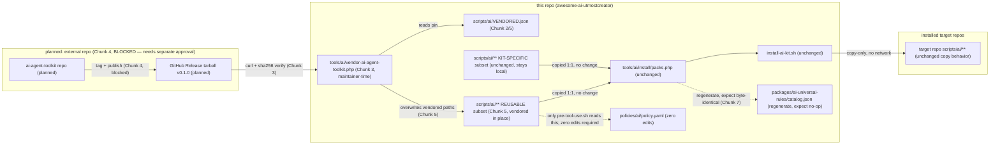

# Architecture Plan — Extract Reusable scripts/ai/\*\* Subset into a New Published CLI Package (ai-agent-toolkit)

- Ticket: none
- Source: architect design session (this conversation), specificity 78/100
- Generated: 20260711-162902
- Plan folder: docs/tickets/arch-todo-scripts-ai-reusable-extraction-20260711-162902/
- Status: **In Progress.** Chunk 1 complete (see `chunk-1-classification-addendum.md`). Chunk 4's
  file-move step is **explicitly user-approved and partially executed**: the REUSABLE bucket
  scripts + `tests/scripts/ai/**` behavioral tests are copied into
  `/home/utmostcreator/Projects/agent-repo-tools` and path-adapted (26 moved test files also
  deleted here, user-approved, after verification), not yet committed there; remaining Chunk 4
  scaffolding — `manifest.json`, `LICENSE`, `CHANGELOG.md`, `hooks/git/*`, `share/completions`,
  `share/wrappers`, `integrations/*`, `test/*.bats` conversion, `command-list.json`, and the
  `v0.1.0` tag/publish — is being finished directly in that repo by the user, outside this session.
  Chunk 2 is unblocked and not yet started. Chunk 3 remains blocked on its own approval gate (new
  tool, future remote-write path). Chunk 5 remains blocked pending Chunk 4's completion and
  requires its own explicit approval before merge (overwrites live, security-policy-allowlisted
  scripts).
- Risk: **Medium-High overall** — Chunk 3 Medium (new tool with an eventual remote-write code
  path), Chunk 4 High (external repository creation/publish — separately gated), Chunk 5
  Medium-High (bulk-overwrites live, agent-executed, security-policy-allowlisted scripts).

> **Completion note:** When every `## Todo Plan` item and every `## Acceptance Criteria` item
> below is checked `[x]`, move this file to `archive/DONE-plan.md` under this ticket folder,
> matching this repo's existing convention (see e.g.
> `docs/tickets/arch-todo-install-editions-20260614-230848/archive/DONE-plan.md`).

## mandatory move to another repo(SOURCE OF TRUTH):

1. [x] all_in_one.sh + rename — moved and renamed to `all-f-into-one.sh` in
       `/home/utmostcreator/Projects/agent-repo-tools` (fresh copy, source deleted here). Zsh vs.
       bash rewrite decision left open per the addendum's "Open item for Chunk 4 execution."
2. [x] ai-edit.sh, ai-rollback.sh + internal/ai-edit/{10-helpers,30-parse,40-plan-apply,90-main}.sh — moved (source deleted here).
3. [x] sh-introspect.sh — moved (source deleted here); the addendum's cross-cutting
       `tools/ai/sh-introspect.php` dependency decision is still open (see "Cross-cutting finding").
4. [x] ai-verify.sh + 5 thin per-language wrappers (ai-verify-{html,js,php,ts,vue}.sh) + internal/ai-verify/\*\* (14 modules) — moved (source deleted here).
5. [x] stays in origianl repo and then it will be replaced by suggesting scripts instllation `install-mandatory-tools.sh` — confirmed satisfied by inaction: per the addendum, this item refers to `install-mandatory-tools.sh` itself, which stays unchanged in this repo and was never part of the migration.

## NEW SOURCE REPO STRUCTURE (SOURCE OF TRUTH):

move files into appropariate files

target repo: `/home/utmostcreator/Projects/agent-repo-tools`

```
ai-agent-toolkit/
├── bin/
│   └── ai
│
├── libexec/
│   ├── ai-diff-context
│   ├── ai-doc-check
│   ├── ai-edit
│   ├── ai-file-freshness
│   ├── ai-rollback
│   ├── ai-search
│   ├── ai-search-introspect
│   ├── ai-search-multi
│   ├── ai-structured
│   ├── ai-task
│   ├── ai-test-select
│   ├── ai-verify
│   ├── check-file-refs
│   ├── fd-files
│   ├── gh-pr-context
│   ├── git-branch-origin
│   ├── git-forensics
│   ├── pack-context
│   ├── preview-file
│   ├── query-usage
│   ├── repomix-context-tree
│   ├── repomix-ensure-fresh
│   ├── repomix-freshness
│   ├── repomix-scc-router
│   ├── repo-stats
│   ├── repo-tool-inventory
│   ├── rg-code
│   ├── run-repomix-context
│   ├── run-repomix-file
│   ├── run-repo-tests
│   ├── run-test-focused
│   ├── session-checkpoint
│   ├── sh-introspect
│   └── watch-loop
│
├── lib/
│   ├── environment.sh
│   ├── core.sh
│   ├── json.sh
│   ├── paths.sh
│   ├── logging.sh
│   ├── log-redaction.sh
│   ├── session.sh
│   ├── policy.sh
│   ├── exec-guard.sh
│   ├── secrets.sh
│   ├── tokens.sh
│   ├── snapshot.sh
│   │
│   ├── exec-guard/
│   │   ├── run-timeout.sh
│   │   ├── cpu-sampling.sh
│   │   ├── kill-tree.sh
│   │   └── run-guarded.sh
│   │
│   ├── ai-diff-context/
│   │   ├── helpers.sh
│   │   └── commands.sh
│   │
│   ├── ai-edit/
│   │   ├── helpers.sh
│   │   ├── parse.sh
│   │   └── plan-apply.sh
│   │
│   ├── ai-search/
│   │   ├── contract.sh
│   │   ├── state.sh
│   │   ├── modes.sh
│   │   ├── parse-flags.sh
│   │   ├── parse-positionals.sh
│   │   ├── output-json.sh
│   │   ├── results-rg.sh
│   │   ├── results-context.sh
│   │   ├── scope-args.sh
│   │   ├── guards.sh
│   │   ├── backend-files.sh
│   │   ├── backend-text.sh
│   │   ├── backend-git.sh
│   │   ├── backend-curated.sh
│   │   ├── backend-ast.sh
│   │   ├── doctor.sh
│   │   └── dispatch.sh
│   │
│   ├── ai-verify/
│   │   ├── scope.sh
│   │   ├── line-count.sh
│   │   ├── duplication.sh
│   │   ├── step-runner.sh
│   │   ├── tool-policy.sh
│   │   ├── language-files.sh
│   │   ├── language-dispatch.sh
│   │   ├── reporting.sh
│   │   ├── kotlin-files.sh
│   │   ├── gradle-policy.sh
│   │   ├── android-guards.sh
│   │   └── kotlin-dispatch.sh
│   │
│   ├── repomix-context-tree/
│   │   ├── helpers.sh
│   │   └── build-pack.sh
│   │
│   ├── repomix-scc-router/
│   │   ├── helpers.sh
│   │   └── analysis-pack.sh
│   │
│   └── repomix/
│       └── common-options.sh
│
├── hooks/
│   ├── agent/
│   │   ├── post-tool-use
│   │   ├── pre-tool-use
│   │   ├── session-checkpoint
│   │   └── watch-loop
│   └── git/
│       ├── commit-msg
│       └── pre-commit
│
├── share/
│   ├── config/
│   │   ├── exclude-dirs.txt
│   │   └── source-exclude-dirs.txt
│   ├── completions/
│   └── wrappers/
│
├── integrations/
│   ├── claude/
│   ├── copilot/
│   └── opencode/
│
├── test/
│   ├── command-list.bats
│   ├── ai-edit.bats
│   ├── ai-rollback.bats
│   ├── ai-search.bats
│   ├── ai-verify.bats
│   ├── exec-guard.bats
│   ├── secrets.bats
│   └── fixtures/
│
├── command-list.json
├── install.sh
├── README.md
├── CHANGELOG.md
└── LICENSE
```

## Scope Note (Chunk Authorization)

This ticket documents the **specification and staged plan only**. Chunk 4 (creating the actual
external `ai-agent-toolkit` repository and publishing a release) is **explicitly NOT authorized**
by this ticket and requires separate, explicit human approval naming the external org/repo before
execution, per this repo's External Project Context Policy (`AGENTS.md` → "External Project
Context Policy"). Chunk 3 (new tool with an eventual remote-write capability) and Chunk 5
(overwriting live, security-policy-allowlisted scripts) also require explicit approval per the
plan below, per `docs/ai/approval-boundaries.md`.

## Instruction Specificity

Score: 78/100. Target (this repo's `scripts/ai/**`), outcome (bounded extraction +
this-repo integration design), and most boundaries are explicit and pre-researched by the user.
Deductions: (1) packaging channel was left to architect to justify — resolved (GitHub Releases
tarball); (2) "install-ai-kit.sh pulls a pinned version... before the existing copy-to-target
step" was ambiguous between runtime-per-install fetch and maintainer-time vendor-update — resolved
explicitly (maintainer-time); (3) exact classification of `ai-install-coverage.sh`,
`session-checkpoint.sh`, `sh-introspect.sh` rests on `MANIFEST.md` role labels rather than full
source reads — flagged as assumptions requiring Chunk 1 verification, not asserted as fact.

## Extracted User Intent

Split `scripts/ai/**` into: (a) a new, separately published, installable CLI package containing
only scripts whose value does not depend on this repo's install/policy/catalog pipeline, and (b)
scripts that stay because they exist specifically to enforce or emit this kit's own governance
model. Produce a bounded plan for both sides plus the integration seam, without inventing behavior
not evidenced in the repo.

## User-Stated Acceptance Criteria

- Explicit, testable extraction criteria distinguishing REUSABLE / KIT-SPECIFIC / BORDERLINE.
- Every top-level `scripts/ai/*.sh` (49 confirmed) plus `scripts/ai/internal/**` module tree
  classified.
- Package shape decided and justified (name, distribution channel, manifest/lock shape) against
  multi-language target support and `install-ai-kit.sh`'s curl-and-run philosophy.
- Confirm/refute that the extracted package installs at a `scripts/ai/`-equivalent relative path
  so this repo's own path assumptions keep working, or justify an alternative with every coupling
  point updated.
- This-repo integration design: fetch/vendor mechanism, `catalog.json` impact,
  `tests/scripts/ai/*.sh` fate, and confirmation of whether `policies/ai/policy.yaml` / adapter
  `settings.json` need edits.
- Staged, independently verifiable implementation plan with real verification commands, explicit
  risk classification, and approval flags per this repo's own approval-boundary rules.
- No invented behavior; state assumptions and open questions.

## Inferred Acceptance Criteria

- The classification must be reusable as a policy, not a one-off judgment call — a future new
  script must be classifiable by the same test.
- The new package's own manifest/lock must mirror the shape of
  `packages/ai-universal-rules/manifest.json` + `package-lock.ai.json`, not literally reuse those
  files.
- Creating and publishing a brand-new external repository is itself an external-project action,
  flagged as requiring separate explicit human approval per `AGENTS.md`'s External Project Context
  Policy — the architect cannot approve or perform it.
- Because several `scripts/ai/*.sh` are on this repo's own security-policy allowlist
  (`policies/ai/policy.yaml`) and Claude/OpenCode `allowedBash` lists, any chunk that
  bulk-overwrites those live files is inherently medium/high risk and needs explicit approval,
  even though the end-state paths are unchanged.

## Negative Acceptance Criteria (Out Of Scope / Things To Avoid)

- Must **NOT** rename or relocate any currently-shipped `scripts/ai/<name>.sh` path —
  `policies/ai/policy.yaml`, `templates/claude/settings.json`, `templates/opencode/**`, and
  `tests/scripts/ai/*.sh` all hardcode literal `scripts/ai/<name>.sh` strings; any rename is a
  breaking change to the security-policy surface.
- Must **NOT** force a JS/PHP-specific runtime (npm/Composer) as the required install mechanism
  for the new package, since this kit targets 11+ language stacks
  (`packages/ai-universal-rules/stacks/*.json`: python, ruby, go, php, java, js-ts, dotnet, rust,
  shell, make, github-actions).
- Must **NOT** silently widen `policies/ai/policy.yaml` allow/confirm/deny rules or `allowedBash`
  permission lists as a side effect of vendoring — confirmed classification shows these files need
  zero edits if paths stay identical; any edit to them in a later chunk is a scope-creep flag, not
  a normal side effect.
- Must **NOT** move `pre-tool-use.sh`, `post-tool-use.sh`, `ai-edit.sh`/`ai-rollback.sh`,
  `prune-shipped-targets.sh`, or `list-todos.sh` — these directly consume
  `policies/ai/policy.yaml`, `.ai-install-manifest.json`, this kit's snapshot/evidence contract, or
  the `docs/tickets/**/plan*.md` convention.
- Must **NOT** perform the actual external-repo creation/publish (Chunk 4) without a separate,
  explicit, named approval — this plan documents what that repo must contain, not permission to
  create it.

## Relevant Evidence

- `scripts/ai/MANIFEST.md` — authoritative current inventory: 49 top-level public/facade scripts
  with target role (context|verify|edit|read|admin|hooks|internal-lib) and risk
  (read-only|mutating), plus 26 internal/lib/** + internal/search/** private modules, and a
  documented P4 "generated `bin/<role>/` delegating shim" tree that must not be hand-edited.
- `docs/ai/script-registry.json` (schema_version 1.1.0, 1039 lines) — per-script risk,
  autonomy_level, profiles, `mutates_state`, `requires_approval`, `supports_dry_run`,
  `required_tools`, `writes_paths`; generated from `tools/ai/install/script-registry.php` (single
  source of truth).
- `policies/ai/policy.yaml` (root, duplicated at
  `packages/ai-universal-rules/policies/ai/policy.yaml`) — hardcoded regex
  `tier1-read-only-scripts` / `tier1-generated-output-scripts` / `tier1-ai-edit-dryrun` /
  `tier1-ai-rollback-read` / `tier1-repomix-read` patterns keyed to literal
  `scripts/ai/<name>.sh` paths. Only `pre-tool-use.sh` (line 40) reads this file at runtime —
  confirmed via repo-wide grep; no other script depends on it, which is the key evidence enabling
  zero-touch vendoring.
- `packages/ai-universal-rules/templates/claude/settings.json` — 55 `allowedBash` entries, all
  keyed to literal top-level `scripts/ai/<name>.sh` paths; zero references to
  `scripts/ai/internal/**` (internal modules are only sourced, never directly invoked, so they
  need no permission entries of their own).
- `tools/ai/install/packs.php` (`scripts-pack` entry, lines ~224-286) — the actual copy mechanism
  `install-ai-kit.sh` triggers (via `tools/ai/install-ai-kit.php`), confirming: `common.sh`,
  `internal/` (whole dir), `bin/` (whole dir), and every named top-level script are copied 1:1 from
  `source: scripts/ai/X` to `target: scripts/ai/X` in the target repo. `install-ai-kit.sh` itself
  does not loop over files directly — it shells out to `tools/ai/install-ai-kit.php`, which reads
  this pack table.
- `tools/ai/install/permission-layers/script-tiers.php` — turns `script-registry.php` entries into
  5 permission tiers (ai-read, ai-context-ask, ai-verify, ai-write, ai-deny-dangerous).
- `scripts/ai/internal/lib/50-policy.sh` — confirmed self-contained: a hardcoded shell `case`
  statement for command classification (`classify_command`, `enforce_command_policy`). Does NOT
  read `policies/ai/policy.yaml`. This proves `common.sh` + all of `internal/lib/**` (12 modules +
  `exec-guard/` 4 submodules) has no runtime coupling to this kit's policy file — it is a
  genuinely portable bash "agent shell stdlib."
- `scripts/ai/internal/ai-verify/90-run.sh` (419 lines, read in full) — confirmed mostly generic:
  presence-driven dispatch over shellcheck/shfmt/actionlint, `composer.json` →
  pint/phpstan/psalm/phpunit/pest/deptrac, `package.json` →
  pnpm/npm lint/typecheck/test/playwright/vitest, gitleaks/trivy/semgrep/osv-scanner. Two embedded
  kit-specific calls: `check_plan_status` (Todo-checklist guardrail over `docs/tickets/**/plan*.md`)
  and `is_ai_kit_source_repo`/`all_php_files_excluding_shipped` (in `20-shipped-filters.sh`,
  detects `packages/ai-universal-rules/templates` + `package-lock.ai.json` to exclude "shipped"
  files from lint in installed targets) — both are this kit's own conventions, not generic
  verification behavior.
- `scripts/ai/ai-task.sh` (read, lines 1-40) — generic project-command discovery (`package.json`
  scripts, package-manager detection) with no kit-specific path references; its `ai-deny-dangerous`
  tier membership reflects that it executes discovered commands (mutation risk), not
  kit-specificity.
- `scripts/ai/prune-shipped-targets.sh` (header) — explicit: "Read `.ai-install-manifest.json` and
  operate on the kit-author's local copies of files installed from
  `packages/ai-universal-rules/templates/**`" — unambiguously kit-author-only.
- `scripts/ai/list-todos.sh` — explicit: scans `docs/tickets/**/plan*.md` for this kit's own Todo
  Plan/Acceptance Criteria checklist convention, including the `archive/DONE-<name>` convention
  (confirmed directly in this repo: see e.g.
  `docs/tickets/arch-todo-install-editions-20260614-230848/archive/DONE-plan.md`).
- `packages/ai-universal-rules/manifest.json` / `package-lock.ai.json` — precedent shape:
  `manifest.json` has `name`, `version` (semver), `description`, `required_templates`,
  `generated_outputs`, `release.{export_root,bundle_prefix,notes,max_bundle_lines}`;
  `package-lock.ai.json` has `schema_version`, `package`, `source_checksums: {path:
"sha256:<hex>"}` per shipped file.
- `packages/ai-universal-rules/stacks/*.json` — 11 stack files (github-actions, python, ruby, go,
  markdown, shell, dotnet, make, rust, php, java, js-ts) confirming genuine multi-language target
  support, which rules out a hard npm/Composer runtime dependency for the extracted package.
- `install-ai-kit.sh` (full read, 306 lines) — confirms the "curl-and-run" philosophy: invoked
  directly (`curl ... | bash` or `bash install-ai-kit.sh <target>`), checks php/composer/git/jq as
  prerequisites, never performs any network fetch of `scripts/ai/**` content — everything is
  copied from `$SCRIPT_DIR` (this repo's own tree).
- `tests/scripts/ai/*.sh` — 36 bats-style test files (confirmed via glob), one per script/topic,
  plus `run-all-tests.sh` — the harness `docs/ai/execution-protocol.md` names as
  `bash tests/scripts/ai/run-all-tests.sh` (360s budget).

## Extraction Criteria (Generalizable Test)

A script (or its private `internal/<name>/**` module tree) is:

- **REUSABLE** iff, reading its source, it does NOT reference: `policies/ai/policy.yaml`,
  `.ai-install-manifest.json`, `.ai/catalog.json`, `packages/ai-universal-rules/**`,
  `docs/tickets/**` plan-file conventions, or `is_ai_kit_source_repo`-style "am I the kit's own
  source repo" detection — i.e., it would behave identically if dropped into an unrelated repo
  with no knowledge of this kit's install/policy/catalog model. Confirmed by direct source grep,
  not by name alone.
- **KIT-SPECIFIC** iff it exists specifically to read, write, or enforce one of those kit-owned
  artifacts/conventions — removing this kit's install/policy model would make the script
  meaningless.
- **BORDERLINE** iff the mechanism is generic but a subset of its behavior is a kit-owned
  convention grafted onto an otherwise portable engine — the decision is whether to hookify
  (extract engine, kit-specific behavior becomes an optional plugin) or keep the whole thing local
  until that refactor is worth doing on its own.

## Script Classification Table

Confidence: `[confirmed]` = source read/grepped directly this session; `[inferred]` = MANIFEST.md
role/name only, not independently source-verified — flagged as an assumption for Chunk 1
verification.

### REUSABLE — candidates for extraction

| Script                                                                                                                                                                                                                                                                                             | Rationale                                                                                                                                                                                                                                                                                                                                                 |
| -------------------------------------------------------------------------------------------------------------------------------------------------------------------------------------------------------------------------------------------------------------------------------------------------- | --------------------------------------------------------------------------------------------------------------------------------------------------------------------------------------------------------------------------------------------------------------------------------------------------------------------------------------------------------- |
| `common.sh` + `internal/lib/{00-env,05-core,10-json,20-paths,30-logging,31-log-redaction,40-session,50-policy,60-exec-guard,70-secrets,80-tokens,90-snapshot}.sh` + `internal/lib/exec-guard/*.sh`                                                                                                 | `[confirmed]` `50-policy.sh` proven self-contained (no `policy.yaml` read); shared bash stdlib (env/logging/json/paths/session/secrets-redaction/token-count/timeout-guard) with no kit-specific paths anywhere in the facade contract. Used by every script including kit-specific ones — extraction makes it a shared dependency, not a duplicated one. |
| `ai-search.sh`, `ai-search-multi.sh`, `ai-search-introspect.sh` + `internal/search/**` (18 modules)                                                                                                                                                                                                | `[confirmed]` generic rg/fd/git/ast-grep search facade; `policies/ai/policy.yaml`/`settings.json` grep confirms only top-level paths are policy-referenced, `50-policy.sh` confirms no policy-file read inside the tool itself.                                                                                                                           |
| `ai-diff-context.sh` + `internal/ai-diff-context/{10-helpers,40-commands,90-main}.sh`                                                                                                                                                                                                              | `[inferred]` generic diff-aware context extraction (git diff analysis), no kit-path references found in top-level grep sweep.                                                                                                                                                                                                                             |
| `rg-code.sh`, `fd-files.sh`                                                                                                                                                                                                                                                                        | `[confirmed]` thin generic search wrappers, `required_tools` in registry are rg/fd only.                                                                                                                                                                                                                                                                  |
| `preview-file.sh`                                                                                                                                                                                                                                                                                  | `[confirmed]` generic safe file preview with binary/secret-glob guards; no kit-path coupling.                                                                                                                                                                                                                                                             |
| `git-forensics.sh`, `git-branch-origin.sh`                                                                                                                                                                                                                                                         | `[inferred]` generic read-only git history tools, git-only required tool per registry.                                                                                                                                                                                                                                                                    |
| `gh-pr-context.sh`                                                                                                                                                                                                                                                                                 | `[inferred]` generic gh CLI PR-context wrapper.                                                                                                                                                                                                                                                                                                           |
| `query-usage.sh`                                                                                                                                                                                                                                                                                   | `[confirmed]` generic token/usage estimator.                                                                                                                                                                                                                                                                                                              |
| `repo-stats.sh`, `repo-tool-inventory.sh`                                                                                                                                                                                                                                                          | `[inferred]` generic repo statistics / installed-CLI-tool inventory.                                                                                                                                                                                                                                                                                      |
| `ai-file-freshness.sh`                                                                                                                                                                                                                                                                             | `[inferred]` generic file-freshness inspection.                                                                                                                                                                                                                                                                                                           |
| `check-file-refs.sh`                                                                                                                                                                                                                                                                               | `[inferred]` generic file-reference validator, parameterized by path args.                                                                                                                                                                                                                                                                                |
| `ai-doc-check.sh`                                                                                                                                                                                                                                                                                  | `[confirmed via install-ai-kit.sh usage]` invoked as `ai-doc-check.sh markdownlint docs/ai .github ...` — fully parameterized by path args, not hardcoded to kit doc paths.                                                                                                                                                                               |
| `ai-test-select.sh`, `run-test-focused.sh`, `run-repo-tests.sh`                                                                                                                                                                                                                                    | `[inferred]` generic language/framework-detecting test-selection and runner heuristics.                                                                                                                                                                                                                                                                   |
| `pack-context.sh`, `repomix-context-tree.sh`, `repomix-scc-router.sh` (+ `internal/repomix-scc-router/**`), `internal/repomix-context-tree/**`, `repomix-freshness.sh`, `repomix-ensure-fresh.sh`, `run-repomix-context.sh`, `run-repomix-file.sh` (+ `internal/repomix-shared/10-common-opts.sh`) | `[inferred]` generic repomix wrappers — useful in any repo with repomix/scc installed; no catalog/manifest coupling found.                                                                                                                                                                                                                                |
| `ai-structured.sh`                                                                                                                                                                                                                                                                                 | `[inferred]` generic structured evidence/context helper (task/JSON packaging), no kit-path references found.                                                                                                                                                                                                                                              |
| `watch-loop.sh`                                                                                                                                                                                                                                                                                    | `[inferred]` generic long-running file-watch trigger loop.                                                                                                                                                                                                                                                                                                |

### KIT-SPECIFIC — must stay

| Script                                                                                             | Rationale                                                                                                                                                                                                                               |
| -------------------------------------------------------------------------------------------------- | --------------------------------------------------------------------------------------------------------------------------------------------------------------------------------------------------------------------------------------- |
| `pre-tool-use.sh` + `internal/pre-tool-use/{10-helpers,20-decide}.sh`                              | `[confirmed]` the only script reading `policies/ai/policy.yaml` (line 40) — this kit's own runtime security gate.                                                                                                                       |
| `post-tool-use.sh`                                                                                 | `[inferred, high confidence]` MANIFEST-documented as "post-tool evidence/runtime hook" — the counterpart evidence-emission half of the pre/post hook pair; emits this kit's `.ai-logs` evidence-event schema.                           |
| `ai-edit.sh`, `ai-rollback.sh` + `internal/ai-edit/{10-helpers,30-parse,40-plan-apply,90-main}.sh` | `[inferred]` MANIFEST: "guarded" edit/rollback tightly bound to `internal/lib/90-snapshot.sh`'s snapshot/evidence contract — this kit's own governance model for AI-driven edits, not a generic patch tool.                             |
| `prune-shipped-targets.sh` + `internal/prune-shipped-targets/{10-rules,60-apply,90-run}.sh`        | `[confirmed]` header explicitly reads `.ai-install-manifest.json` and operates on `packages/ai-universal-rules/templates/**` copies — kit-author-only maintenance.                                                                      |
| `list-todos.sh`                                                                                    | `[confirmed]` scans `docs/tickets/**/plan*.md` for this kit's own Todo Plan/Acceptance Criteria + `archive/DONE-<name>` convention.                                                                                                     |
| `all_in_one.sh`                                                                                    | `[inferred]` MANIFEST: "administrative all-in-one workflow," not registry-listed; admin-role scripts in this kit orchestrate the install/verify/catalog pipeline end-to-end.                                                            |
| `build-ai-help-bundle.sh`                                                                          | `[inferred]` MANIFEST: "help bundle build helper," not registry-listed; builds this kit's own `llms.txt`/help artifacts from its own docs/catalog.                                                                                      |
| `ai-install-coverage.sh`                                                                           | `[inferred]` "install coverage verification" — reads as checking this kit's own install-surface coverage against its manifest/catalog, not a generic tool.                                                                              |
| `ship-audit.sh`                                                                                    | `[confirmed]` reads a forbidden-path config list (`docs/ai/generated`, `docs/tickets`, `.ai-logs`, `vendor`, `dist`, `node_modules`) and audits this kit's own shipped installer packs — meaningless outside this kit's shipping model. |

### BORDERLINE — explicit decision required

| Script                                                                                                                     | Mechanism vs. kit-specific behavior                                                                                                                                                                                                                                                                                                        | Decision                                                                                                                                                                                                                                                                                                                                                                                                      |
| -------------------------------------------------------------------------------------------------------------------------- | ------------------------------------------------------------------------------------------------------------------------------------------------------------------------------------------------------------------------------------------------------------------------------------------------------------------------------------------ | ------------------------------------------------------------------------------------------------------------------------------------------------------------------------------------------------------------------------------------------------------------------------------------------------------------------------------------------------------------------------------------------------------------- |
| `ai-verify.sh` + 5 thin per-language wrappers (`ai-verify-{html,js,php,ts,vue}.sh`) + `internal/ai-verify/**` (14 modules) | `[confirmed]` `90-run.sh` (419 lines, read in full) is ~90% generic presence-driven language dispatch. Two kit-specific calls grafted in: `check_plan_status` (`docs/tickets` Todo-checklist guardrail) and `is_ai_kit_source_repo`/shipped-file exclusion in `20-shipped-filters.sh`.                                                     | Stay in this repo for v1. Extracting a half-generic tool that silently assumes a `docs/tickets` convention when installed standalone into an unrelated project is worse than not extracting it. Flag as a fast-follow candidate once `check_plan_status` and the shipped-file-exclusion logic are refactored into optional, env/config-gated plugin hooks — that refactor is itself a separate bounded slice. |
| `install-mandatory-tools.sh`                                                                                               | `[inferred]` mechanism (detect OS package manager, install missing CLI tools) is generic; the specific "mandatory tools" list (rg/fd/jq/php/composer/git) is this kit's own toolchain curation.                                                                                                                                            | Stay in this repo for v1. A generic project would want a different tool list; extracting the mechanism with an externally-supplied list is a real but lower-priority fast-follow.                                                                                                                                                                                                                             |
| `session-checkpoint.sh`                                                                                                    | `[inferred]` MANIFEST: "session continuity snapshot," mutating hook. Uses `internal/lib/40-session.sh` (itself REUSABLE), but the checkpoint schema/consumer contract was not independently source-verified this session.                                                                                                                  | Stay in this repo for v1, pending source verification in Chunk 1 — insufficient evidence to safely extract; do not guess.                                                                                                                                                                                                                                                                                     |
| `sh-introspect.sh`                                                                                                         | `[confirmed via MANIFEST P4]` generic mechanism (scans shell scripts for shebang/usage), but its primary documented purpose is validating this kit's own `bin/<role>/` shim byte-identity contract (P4/P5 migration) and `script-registry.php` parity — a kit-internal consistency tool, not a general-purpose script indexer in practice. | Stay in this repo. Its value is intrinsically tied to this kit's generated-shim contract.                                                                                                                                                                                                                                                                                                                     |

**Internal module inheritance rule:** `internal/<name>/**` inherits the classification of the
single top-level facade that sources it (`ai-search.sh` → `internal/search/**`; `ai-verify.sh` →
`internal/ai-verify/**`; `pre-tool-use.sh` → `internal/pre-tool-use/**`;
`ai-edit.sh`/`ai-rollback.sh` → `internal/ai-edit/**`; `prune-shipped-targets.sh` →
`internal/prune-shipped-targets/**`; repomix scripts → `internal/repomix-{scc-router,context-tree,shared}/**`;
`ai-diff-context.sh` → `internal/ai-diff-context/**`). `internal/lib/**` is the one exception —
sourced by every script (including kit-specific ones) via `common.sh`, so it is extracted as a
shared dependency that kit-specific scripts continue to consume post-extraction, unchanged in
behavior.

`scripts/ai/bin/**` (the generated P4 role/risk shim tree) is out of scope for this extraction —
per MANIFEST.md, these are derived, byte-identical exec shims regenerated from canonical root
paths; the existing generator is agnostic to whether the canonical file is vendored or
hand-authored.

## Target Repo Design

**Confirm/refute install-path design: CONFIRMED.** The extracted package must install at a
`scripts/ai/`-equivalent relative path inside this repo's own working tree (not a global-PATH
binary, not a differently-named subdirectory), because `policy.yaml` and `settings.json` both
hardcode literal `scripts/ai/<name>.sh` strings and neither references `internal/**` subpaths
directly. As long as vendored files land at their exact current relative paths, **ZERO edits**
are required to `policies/ai/policy.yaml`,
`packages/ai-universal-rules/policies/ai/policy.yaml`, or `templates/claude/settings.json` (and by
the same logic, the equivalent OpenCode/Copilot `allowedBash` renderer outputs). This is the
single design constraint that makes the whole extraction low-risk on the security-policy surface.

**Package name:** `ai-agent-toolkit` (retain user's working name — directly descriptive, no
implication it runs models itself).

**Distribution channel:** GitHub Releases tarball (primary), not npm or Composer. Justification:

- (a) **Multi-language target support**: this kit installs into PHP, Python, Ruby, Go, Rust, Java,
  JS/TS, .NET, and shell-only projects (11 confirmed stack files). Requiring `npm install` or
  `composer require` as the ONLY distribution path would force an unrelated language runtime onto
  e.g. a pure-Go or pure-Rust target, contradicting the kit's own multi-stack design. A tarball of
  bash scripts has no runtime dependency beyond bash+tar+curl, which `install-ai-kit.sh` already
  assumes.
- (b) **`install-ai-kit.sh`'s existing curl-and-run philosophy**: already does prerequisite checks
  (php composer git jq) and shells straight into PHP tooling with no package-manager indirection.
  A GitHub Release tarball, fetched with curl, checksum-verified, and extracted with tar, is the
  same operational shape at one more layer of indirection (kit-repo vendors a dependency), not a
  new one.
- npm is **NOT** excluded as a future secondary channel (e.g. `npx ai-agent-toolkit` for JS-heavy
  teams) — but it must never be the only path, and is out of scope for v1.

**Manifest/lock shape** (mirrors `packages/ai-universal-rules/manifest.json` +
`package-lock.ai.json` shape, not literal reuse):

- `manifest.json`: `name: "ai-agent-toolkit"`, `version` (semver), `description`,
  `supported_shells: ["bash>=4"]`, `required_tools` (baseline bash,git,jq; per-script
  `optional_tools` mirrored from this repo's `script-registry.json`),
  `scripts: [<list of shipped relative paths>]`,
  `release: {export_root, bundle_prefix, notes}`.
- `package-lock.ai.json`-shaped lock: `schema_version`, `package`,
  `source_checksums: {"<relative path>": "sha256:<hex>", ...}` for every shipped file — this is
  what `tools/ai/vendor-ai-agent-toolkit.php` (this repo) verifies against before overwriting
  anything.
- Tests: the full behavioral `tests/scripts/ai/test-*.sh` files for every REUSABLE script **MOVE**
  to the new repo and run in that repo's own CI.

## This-Repo Integration Design

**Fetch/vendor mechanism — maintainer-time, not consumer-runtime.** The pinned-version fetch
happens as a new, explicit, maintainer-only step (`tools/ai/vendor-ai-agent-toolkit.php`, run
manually or in a scheduled CI job in THIS repo, never as part of a consumer's
`bash install-ai-kit.sh <target>` invocation). It:

1. Reads a pin from a new `scripts/ai/VENDORED.json` (version + expected sha256 per vendored
   file).
2. Fetches the GitHub Release tarball for that pinned version via curl.
3. Verifies the tarball's sha256 against the pin — fails closed on mismatch (supply-chain
   integrity gate).
4. Extracts and overwrites exactly the vendored relative paths inside this repo's own
   `scripts/ai/**` working tree.
5. Updates `scripts/ai/VENDORED.json` with the new pin + per-file checksums.
6. Leaves the result as an uncommitted git diff for human review before commit.

**Why maintainer-time, not runtime-per-install:** `install-ai-kit.sh` already just copies this
repo's own tracked working tree into targets via `packs.php`
(`tools/ai/install-ai-kit.php`), with zero network calls for `scripts/ai/**` content today. Making
every consumer's install fetch a second remote artifact would (a) add a new runtime network
dependency and failure mode to every install, breaking today's offline-repeatable installs, (b)
contradict the "curl-and-run, then everything else is local" philosophy the installer already
embodies, and (c) mean two different trust boundaries get merged into one install run,
complicating rollback. Vendoring once, at this repo's own release-prep time, keeps
`install-ai-kit.sh` and `packs.php` **COMPLETELY UNCHANGED** — they still just copy this repo's
own tracked tree, whatever its provenance.

**`packages/ai-universal-rules/catalog.json` generation:** No structural change needed. Generated
by `php tools/ai/generate-ai-catalog.php --check` from `packs.php` pack membership +
`script-registry.php` entries; since paths and pack membership are unchanged by vendoring,
regeneration should produce a byte-identical result. Verify explicitly with `--check` rather than
assuming it (Chunk 7).

**`tests/scripts/ai/*.sh` fate — MOVE full behavioral tests to the new repo, replace with a thin
integrity smoke test here.** Standard "vendor a dependency" pattern. This repo keeps a new, small
`test-vendored-scripts.sh` (or extends `test-common-source.sh`) that only checks: each vendored
path exists, is executable, matches its pinned sha256 in `scripts/ai/VENDORED.json`, and responds
to `--help`/`--introspect` with exit 0 — proves vendoring integrity, not the tool's internal
correctness. KIT-SPECIFIC scripts' existing test files stay unchanged.

**`policies/ai/policy.yaml` / adapter `settings.json` changes needed: NONE**, confirmed above.

## Architecture Diagram



## Todo Plan

Priorities: Chunk 1 is done. Chunk 2 is P0 foundation, unblocked, not yet started. Chunk 3 is P0
(blocks everything downstream) and needs explicit approval before it runs against a real remote.
Chunk 4's file-move step is user-approved and partially executed (see status note below); its
scaffolding/publish remainder is being finished by the user directly in `agent-repo-tools`, outside
this ticket. Chunks 5-6 are P0 core migration and remain blocked pending Chunk 4's completion.
Chunks 7-9 are P1 follow-through/hardening.

- [x] P0: Chunk 1 — Verify unresolved classifications (`ai-install-coverage.sh`,
      `session-checkpoint.sh`, `sh-introspect.sh`, and any `[inferred]`-marked entries) by reading
      full source. Produce a confirmed classification addendum.
      **Files:** read-only, no files changed.
      **Verify:** `AI_OUTPUT=json bash scripts/ai/ai-search.sh tracked "docs/tickets|policy.yaml|.ai-install-manifest" scripts/ai --fixed`
      per unresolved script.
      **Risk:** Low. **Approval:** No.
      **Done:** see `chunk-1-classification-addendum.md` — all three flagged scripts re-verified
      to `[confirmed]`, plus the user's Chunk-4 override decision recorded for traceability.
- [ ] P0: Chunk 2 — Add `scripts/ai/VENDORED.json` (schema only — empty vendor set initially),
      `schemas/ai/vendored-manifest.schema.json`, and a "Vendor status" column in
      `scripts/ai/MANIFEST.md`. Purely additive scaffolding, no behavior change.
      **Files:** `scripts/ai/VENDORED.json`, `schemas/ai/vendored-manifest.schema.json`,
      `scripts/ai/MANIFEST.md`.
      **Verify:** `php tools/ai/validate-ai-config.php`;
      `bash scripts/ai/ai-doc-check.sh markdownlint scripts/ai/MANIFEST.md`;
      `bash scripts/ai/ai-doc-check.sh links scripts/ai/MANIFEST.md`.
      **Risk:** Low. **Approval:** No (reviewer sign-off recommended — touches a canonical doc).
- [ ] P0: Chunk 3 — Build `tools/ai/vendor-ai-agent-toolkit.php` (fetch + sha256-verify + extract +
      copy + lock-update), proven against a **LOCAL FIXTURE TARBALL ONLY** — no real remote yet.
      **Files:** `tools/ai/vendor-ai-agent-toolkit.php`, `tests/Tools/VendorAiAgentToolkitTest.php`,
      `tests/fixtures/ai-agent-toolkit-fixture.tar.gz`.
      **Verify:** `composer test:fast --filter=VendorAiAgentToolkit`; manual review of
      tar-extraction path handling for traversal safety.
      **Risk:** Medium (new tool has a future network/write code path; must be reviewed for
      path-traversal/command-injection safety even though unexercised against a real remote here).
      **Approval:** **YES** — new tool with eventual remote-write capability, per
      `docs/ai/approval-boundaries.md` ("dependency installation," "remote writes").
- [~] P0: Chunk 4 — **[EXTERNAL — SEPARATE REPO]** Create `ai-agent-toolkit` repo,
      populate with the REUSABLE bucket (history-preserving split via `git filter-repo`/`git
subtree split`, decided at execution time), migrate corresponding
      `tests/scripts/ai/*.sh` behavioral tests, add `manifest.json`/`package-lock.ai.json`/
      README/LICENSE, tag `v0.1.0`, publish GitHub Release.
      **Files:** primarily outside this repo (`agent-repo-tools/**`); this repo's own touches are
      limited to the source side of the copy-then-delete: `tests/scripts/ai/run-all-tests.sh`
      (SUITES entries removed for moved tests) and `tests/scripts/ai/test-misc-wrappers.sh`
      (trimmed, not deleted) plus the 26 deleted `tests/scripts/ai/test-*.sh` files listed in the
      status note below. **Verify:** new repo's own CI (not yet set up); locally,
      `bash test/<name>.sh` run directly against `agent-repo-tools` for 26 of 30 migrated test
      files plus `test-common.sh`/`test-common-source.sh` (see status note for pass/fail counts).
      **Risk:** High. **Approval:** **YES — MANDATORY, BLOCKING.** This is a new external
      repository/publish action; per `AGENTS.md` External Project Context Policy, requires
      separate explicit approval naming the external path/org before any content is created or
      pushed. This plan documents the specification, not permission to execute it.
      **Status (partial, user-approved and executed):** the user gave explicit approval naming
      `/home/utmostcreator/Projects/agent-repo-tools` and directed the file-move; the REUSABLE
      bucket (40 top-level scripts incl. the item-1-4 overrides above, renamed `all-f-into-one.sh`,
      plus 47 `internal/**` modules) was fresh-copied there (no history preservation — deferred to
      the Chunk 3/5 re-vendor mechanism per the addendum) and `common.sh` +
      `internal/lib/**` (12 files) + `internal/lib/exec-guard/**` (4 files) were copy-only (kept
      here too, since 9 remaining kit-specific scripts source `common.sh`).

      **Test migration (done in a follow-up pass):** the corresponding
      `tests/scripts/ai/test-*.sh` behavioral tests were also moved to
      `agent-repo-tools/test/` (same directory-flattened layout as `libexec/`/`lib/`, not yet the
      `test/*.bats` format the target `README.md` tree specifies — flagged as a remaining Chunk 4
      conversion item), with import paths adapted from `scripts/ai/<name>.sh` to
      `libexec/<name>` / `lib/<module>/<file>.sh`. 26 fully-REUSABLE test files were deleted here
      after being copied and functionally verified there (user-approved, matching the
      copy-then-delete treatment already applied to their scripts). `test-common.sh` +
      `test-common-source.sh` (common.sh is dual-homed) and `test-ai-verify.sh` (ai-verify.sh still
      carries the 2 unresolved kit-specific calls) were copy-only — kept unchanged here too.
      `test-misc-wrappers.sh` was split: the 2 REUSABLE-only test blocks (`repo-stats`,
      `ai-file-freshness`) moved out; the 4 remaining kit-specific/unrelated blocks
      (`ai-install-coverage.sh`, `scripts/doctor.sh`, `scripts/hooks/{pre-commit,commit-msg}.sh`)
      stay in the trimmed file here. `tests/scripts/ai/run-all-tests.sh`'s `SUITES` array was
      updated to drop the 26 moved entries (previously they would have shown a misleading
      "not yet created" skip forever). Verification: 22 of the 26 clean-moved tests plus
      `test-common.sh` (117/118) and `test-common-source.sh` (4/4) pass cleanly in
      `agent-repo-tools`; the 30-file total there was directly executed, not just written.
      **Known gaps found during verification, none caused by the test-file moves themselves:**
      (1) every script whose `--introspect`/`--help` guard needs `tools/ai/sh-introspect.php`
      degrades as already documented in the addendum's cross-cutting finding —
      `test-ai-edit.sh` (2 assertions), `test-sh-introspect.sh` (4, gracefully skipped),
      `test-repo-tool-inventory.sh` (2, gracefully skipped) all surface this; additionally
      `libexec/repo-tool-inventory` and `libexec/sh-introspect` are **entirely** non-functional
      there (not just their `--introspect`/`--help` guard) since their whole purpose is delegating
      to `tools/ai/repo-tool-inventory.php` / `tools/ai/sh-introspect.php`, neither of which was
      ported — a second, more severe instance of the same undecided cross-cutting gap, not
      previously called out for these two scripts specifically. (2) `test-ai-diff-context.sh`'s
      `since HEAD~1` case fails because `agent-repo-tools` currently has only 1 commit
      (`HEAD~1` doesn't resolve) — an environment/history artifact, not a bug, expected to
      self-resolve once real commits land. (3) `test-ai-verify.sh` has 1 failing assertion
      (`branch scope is recognized`) caused by `shfmt -d` finding real 4-space-vs-tab formatting
      drift in `lib/ai-verify/scope.sh` (confirmed systemic: `shfmt -l lib libexec` flags 101
      files) — pre-existing from the earlier file-move pass, not introduced by the test migration,
      and out of scope to bulk-reformat here.
      **Remaining, not done here:** `manifest.json`, `package-lock.ai.json`,
      `LICENSE`, `CHANGELOG.md`, `hooks/git/*`, `share/completions`, `share/wrappers`,
      `integrations/*`, `test/*.bats`, `command-list.json`, the `tools/ai/sh-introspect.php`
      porting decision, and the `v0.1.0` tag/publish — the user is finishing these directly in
      `agent-repo-tools`, outside this session/ticket.
- [ ] P0: Chunk 5 — Point `scripts/ai/VENDORED.json` at the real published `v0.1.0` + real
      sha256s; run `tools/ai/vendor-ai-agent-toolkit.php` for real, overwriting the ~25-30
      REUSABLE-bucket `scripts/ai/*.sh` + `internal/{lib,search,ai-diff-context,repomix-*}/**`
      paths in this repo. Expect a near-zero-diff (proves round-trip fidelity from the split).
      **Files:** `scripts/ai/{ai-search.sh,ai-search-multi.sh,common.sh,...}` (vendored subset
      only), `scripts/ai/internal/{lib,search,ai-diff-context,repomix-*}/**`,
      `scripts/ai/VENDORED.json`.
      **Verify:** `git diff` review (expect only intentional changes);
      `bash scripts/ai/ai-doc-check.sh --check`; `php tools/ai/validate-ai-config.php`;
      `php tools/ai/validate-ai-catalog.php`; `php tools/ai/validate-adapter-drift.php --fail-on-warn`;
      `bash tests/scripts/ai/run-all-tests.sh`; `composer test`.
      **Risk:** Medium-High (touches live, security-policy-allowlisted, agent-executed scripts).
      **Approval:** **YES** — these are the literal files every installed target repo runs;
      explicit approval before merge.
      **Depends on:** Chunk 4 being separately approved and completed first.
- [ ] P0: Chunk 6 — Thin `tests/scripts/ai/test-*.sh` for the now-vendored scripts down to
      integrity/smoke checks (new `test-vendored-scripts.sh` or extended
      `test-common-source.sh`); confirm full behavioral coverage now lives and runs in the new
      repo before removing local depth.
      **Files:** `tests/scripts/ai/test-vendored-scripts.sh` (new), thinned `test-ai-search.sh`,
      `test-preview-file.sh`, `test-rg-code.sh`, `test-fd-files.sh`, `test-git-forensics.sh`,
      `test-git-branch-origin.sh`, `test-gh-pr-context.sh`, `test-query-usage.sh`,
      `test-ai-diff-context.sh`, `test-pack-context.sh`, `test-repomix-*.sh`,
      `test-common.sh`/`test-common-source.sh`, `test-ai-test-select.sh`,
      `test-check-file-refs.sh`, `test-ai-doc-check.sh`, `test-watch-loop.sh`,
      `test-ai-structured.sh`, `test-ai-task.sh`.
      **Verify:** `bash tests/scripts/ai/run-all-tests.sh`.
      **Risk:** Low-Medium (coverage-gap risk if new repo's CI isn't confirmed running the moved
      tests first). **Approval:** No (reviewer must confirm new-repo CI is green before merge).
- [ ] P1: Chunk 7 — Add optional `vendor_source`/`vendor_version` fields to
      `tools/ai/install/script-registry.php` entries for the vendored scripts (additive schema
      only); regenerate `docs/ai/script-registry.json`; confirm `catalog.json` regeneration is a
      no-op.
      **Files:** `tools/ai/install/script-registry.php`, `docs/ai/script-registry.json`
      (regenerated), `schemas/ai/*.json` if strict `additionalProperties` blocks the new key.
      **Verify:** `php tools/ai/validate-ai-catalog.php`; `php tools/ai/validate-generated-artifacts.php`;
      `php tools/ai/generate-ai-catalog.php --check`.
      **Risk:** Low. **Approval:** No (flag for reviewer — canonical generated-artifact pipeline).
- [ ] P1: Chunk 8 — Docs sync: `scripts/ai/MANIFEST.md` vendor-status column filled in per script;
      new `docs/ai/vendoring.md` explaining the split, the pin/update workflow, and how to tell
      vendored vs. local-only files apart.
      **Files:** `scripts/ai/MANIFEST.md`, `docs/ai/vendoring.md` (new).
      **Verify:** `bash scripts/ai/ai-doc-check.sh --check`; `bash scripts/ai/check-file-refs.sh`.
      **Risk:** Low. **Approval:** No.
- [ ] P1: Chunk 9 — CI drift gate: fail if any vendored `scripts/ai/*` file's checksum no longer
      matches `scripts/ai/VENDORED.json` (catches accidental hand-edits that should instead go
      through the new repo + re-vendor).
      **Files:** new `tools/ai/validate-vendor-lock.php`, CI workflow wiring.
      **Verify:** `php tools/ai/validate-vendor-lock.php`.
      **Risk:** Low-Medium (new CI gate could false-positive if scoped too broadly). **Approval:**
      No (reviewer sign-off recommended).

**Things to avoid across all chunks:** renaming any currently-shipped `scripts/ai/<name>.sh`;
editing `policies/ai/policy.yaml` / `templates/claude/settings.json` as a "just in case" side
effect (if a chunk needs to touch either, treat that as a signal the vendored path diverged from
the original and stop); hand-editing anything under `scripts/ai/bin/**` (generated); collapsing
the BORDERLINE `ai-verify.sh` decision into "extract it anyway" without first landing the
plugin-hook refactor as its own bounded slice; running Chunk 3's fetch logic against a real remote
before Chunk 4's approval is granted.

## Acceptance Criteria

- [x] AC-01: Every top-level `scripts/ai/*.sh` (49 confirmed) plus every `scripts/ai/internal/**`
      module tree is classified as REUSABLE, KIT-SPECIFIC, or BORDERLINE in the Script
      Classification Table above, each tagged `[confirmed]` or `[inferred]`, with zero
      unclassified entries after Chunk 1.
- [x] AC-02: The three `[inferred]`-confidence scripts flagged for Chunk-1 verification
      (`ai-install-coverage.sh`, `session-checkpoint.sh`, `sh-introspect.sh`) are re-verified by
      direct source read, and their confidence tag is updated to `[confirmed]` (or their bucket is
      changed) in the classification addendum Chunk 1 produces.
- [ ] AC-03: `scripts/ai/VENDORED.json` and `schemas/ai/vendored-manifest.schema.json` exist,
      `php tools/ai/validate-ai-config.php` passes, and `scripts/ai/MANIFEST.md` has a new "Vendor
      status" column populated for every script.
- [ ] AC-04: `tools/ai/vendor-ai-agent-toolkit.php` exists and is proven end-to-end (fetch +
      sha256-verify + extract + copy + lock-update) against a local fixture tarball only, with
      `composer test:fast --filter=VendorAiAgentToolkit` passing, and it has NOT been executed
      against a real remote endpoint prior to Chunk 4 approval.
- [ ] AC-05: Zero edits land in `policies/ai/policy.yaml`,
      `packages/ai-universal-rules/policies/ai/policy.yaml`, or `templates/claude/settings.json`
      (or the equivalent OpenCode/Copilot `allowedBash` renderer output) as a result of any chunk
      in this plan — confirmed via `git diff` review at Chunk 5.
- [ ] AC-06: No currently-shipped `scripts/ai/<name>.sh` path is renamed or relocated at any point
      in this plan — confirmed via `git diff --stat` path review at every chunk that touches
      `scripts/ai/**`.
- [~] AC-07: The Chunk 4 external-repo-creation/publish step is NOT executed under this ticket
      without a separate, explicit, human approval naming the external org/repo — no external repo
      is created as part of landing Chunks 1-3, 5-9.
      **Status:** the user explicitly named `/home/utmostcreator/Projects/agent-repo-tools` and
      approved the file-move/restructure; the user reconfirmed that approval explicitly in the
      session that produced this doc update. Marked `[~]` rather than `[x]` because the approval
      record for the first execution predates this session and was not itself captured in this
      plan file at that time — a documentation-timing gap, not a known policy violation. The
      `v0.1.0` tag/publish sub-step (the highest-risk part of Chunk 4) has not been executed and
      still requires its own fresh approval when reached.
- [ ] AC-08: After Chunk 5's real vendoring run, `git diff` on the ~25-30 REUSABLE-bucket files is
      near-zero (round-trip fidelity from the split) and the full Chunk-5 verification command set
      passes (`ai-doc-check.sh --check`, `validate-ai-config.php`, `validate-ai-catalog.php`,
      `validate-adapter-drift.php --fail-on-warn`, `tests/scripts/ai/run-all-tests.sh`,
      `composer test`).
- [ ] AC-09: `tests/scripts/ai/*.sh` for the vendored REUSABLE scripts are thinned to
      integrity/smoke checks only (existence, executable, sha256 match against
      `scripts/ai/VENDORED.json`, `--help`/`--introspect` exit 0) after the new repo's own CI is
      confirmed running the moved full behavioral tests.
- [ ] AC-10: `docs/ai/script-registry.json` regenerates with optional `vendor_source`/
      `vendor_version` fields for vendored scripts and `php tools/ai/generate-ai-catalog.php
--check` reports `catalog.json` unchanged (no-op) after vendoring.
- [ ] AC-11: `docs/ai/vendoring.md` exists, documents the split/pin/update workflow and how to
      distinguish vendored vs. local-only files, and `bash scripts/ai/ai-doc-check.sh --check` +
      `bash scripts/ai/check-file-refs.sh` both pass on it.
- [ ] AC-12: A CI drift gate (`tools/ai/validate-vendor-lock.php`) exists and fails when any
      vendored `scripts/ai/*` file's checksum no longer matches `scripts/ai/VENDORED.json`.

## Verification Plan

- AC-01/AC-02 → `AI_OUTPUT=json bash scripts/ai/ai-search.sh tracked "docs/tickets|policy.yaml|.ai-install-manifest" scripts/ai --fixed`
  per unresolved script (Chunk 1).
- AC-03 → `php tools/ai/validate-ai-config.php`; `bash scripts/ai/ai-doc-check.sh markdownlint scripts/ai/MANIFEST.md`;
  `bash scripts/ai/ai-doc-check.sh links scripts/ai/MANIFEST.md` (Chunk 2).
- AC-04 → `composer test:fast --filter=VendorAiAgentToolkit`; manual path-traversal/safety review
  (Chunk 3).
- AC-05/AC-06 → `git diff` / `git diff --stat` review at Chunk 5, scoped to
  `policies/ai/policy.yaml`, `packages/ai-universal-rules/policies/ai/policy.yaml`,
  `templates/claude/settings.json`, and every `scripts/ai/**` path touched.
- AC-07 → repo-state check: `git log`/`git remote -v` in `agent-repo-tools` show no commit/tag/push
  performed under this ticket; Chunk 4's `v0.1.0` tag/publish sub-step remains unchecked until its
  own separate approval is granted and recorded (file-move sub-step approval recorded above).
- AC-08 → `git diff` review; `bash scripts/ai/ai-doc-check.sh --check`;
  `php tools/ai/validate-ai-config.php`; `php tools/ai/validate-ai-catalog.php`;
  `php tools/ai/validate-adapter-drift.php --fail-on-warn`; `bash tests/scripts/ai/run-all-tests.sh`;
  `composer test` (Chunk 5).
- AC-09 → `bash tests/scripts/ai/run-all-tests.sh` (Chunk 6), plus confirmation the new repo's CI
  is green before the local tests are thinned.
- AC-10 → `php tools/ai/validate-ai-catalog.php`; `php tools/ai/validate-generated-artifacts.php`;
  `php tools/ai/generate-ai-catalog.php --check` (Chunk 7).
- AC-11 → `bash scripts/ai/ai-doc-check.sh --check`; `bash scripts/ai/check-file-refs.sh`
  (Chunk 8).
- AC-12 → `php tools/ai/validate-vendor-lock.php` (Chunk 9), including a negative test that a
  hand-edited vendored file trips the gate.

## Risks And Rollback

- **Medium-high (Chunk 5):** `.claude`-adjacent security surface is unaffected in design, but the
  vendoring overwrite itself touches live, security-policy-allowlisted, agent-executed scripts —
  any bug in `tools/ai/vendor-ai-agent-toolkit.php`'s extraction/copy logic could corrupt a script
  every installed target repo's agents run. Mitigation: fixture-tarball proof in Chunk 3 before any
  real run; explicit approval gate before Chunk 5 merges; `git diff` review is mandatory, not
  optional, before commit.
- **High (Chunk 4 tag/publish, still blocked):** publishing a new external repository release is
  inherently outside this repo's control boundary — wrong org, wrong visibility, or premature
  publish cannot be easily undone. The file-move/restructure sub-step has been approved and
  partially executed (see Todo Plan status note); the tag/publish sub-step has not and still
  requires its own separate, explicit, named approval before execution.
- **Medium (Chunk 3):** new tool with a future network-fetch + file-write code path. Mitigation:
  proven only against a local fixture tarball in this plan's scope; sha256 verification fails
  closed; path-traversal safety reviewed explicitly before any real-remote use.
- **Low-medium (Chunk 6):** coverage-gap risk if the new repo's CI is not actually confirmed
  running the moved behavioral tests before this repo's local tests are thinned. Mitigation: Chunk
  6 explicitly makes new-repo CI confirmation a precondition, not an assumption.
- **Low-medium (Chunk 9):** a too-broadly-scoped drift gate could false-positive on unrelated
  changes. Mitigation: scope the gate strictly to the path list in `scripts/ai/VENDORED.json`, not
  a wildcard over `scripts/ai/**`.
- **Rollback for the whole program:** Chunks 1-3 are additive/read-only (new files, no vendoring
  yet) and can be reverted by deleting the new files. Chunk 5 is the first chunk that overwrites
  live files; rollback is `git revert` of that commit (the pre-vendor scripts are the KIT-SPECIFIC
  and not-yet-vendored REUSABLE files, unchanged by design until Chunk 5 runs). Chunk 4, once
  separately approved and executed, is external and not rolled back by anything in this repo — its
  own rollback is scoped to that external repo's own release process.

## Assumptions

- `ai-install-coverage.sh`, `session-checkpoint.sh`, and `sh-introspect.sh` classifications rest on
  `MANIFEST.md` role labels, not independently verified source reads — Chunk 1 exists specifically
  to close this gap before Chunk 4/5 proceed.
- `catalog.json`'s generation is assumed byte-identical after vendoring since it derives from
  `packs.php` pack membership + path lists, not provenance; not independently proven by reading the
  generator's full source this session — verify via `--check` in Chunk 7, not assumed.
- `schemas/ai/*.json` for `script-registry.json` is assumed to tolerate an additive
  `vendor_source`/`vendor_version` key (i.e., does not declare `additionalProperties: false` on
  script entries) — not verified this session.
- History-preservation approach for the Chunk 4 split (`git filter-repo` vs `git subtree split` vs
  fresh copy) is left as an execution-time decision for whoever performs the (separately approved)
  external repo creation.
- "Curl + tar + sha256" is assumed available in the maintainer's environment for
  `tools/ai/vendor-ai-agent-toolkit.php`; if the maintainer environment differs, the tool's
  implementation (PHP curl extension or shell-out) is an implementation detail for Chunk 3.

## Open Questions

1. Should `ai-agent-toolkit` also ship an npm wrapper (`npx ai-agent-toolkit`) as a secondary,
   non-default distribution channel, or is GitHub Releases tarball the only channel for v1?
   (Recommend: tarball only for v1, revisit if demand appears.)
2. Should the BORDERLINE `ai-verify.sh` plugin-hook refactor be scoped as an explicit follow-on
   ticket now, or deferred until there's a concrete second consumer? (Recommend: file a follow-on
   ticket stub now, implement later.)
3. Who owns and hosts the new `ai-agent-toolkit` GitHub org/repo, and what release-signing/
   provenance guarantees (e.g., Sigstore, GPG-signed tags) are expected beyond the sha256 pin in
   `VENDORED.json`? Not addressed by current repo evidence — needs a human decision before Chunk 4.

## Handoff Notes

Implement in chunk order 1 → 2 → 3 → (STOP, get separate approval) → 4 → 5 → 6 → 7 → 8 → 9. Chunks
1-2 can land as a single small, low-risk PR. Chunk 3 is its own reviewed PR (new tool, medium
risk, approval required) and must not be extended to call a real remote endpoint. **Chunk 4 is a
hard stop**: do not create or push to any external repository under this ticket without a
separate, explicit, human approval that names the external org/repo — route back to the user (not
to `architect` or `implementer`) for that decision before proceeding past Chunk 3. Once Chunk 4 is
externally approved and completed, Chunks 5-6 are the highest-risk in-repo slice (live
security-policy-allowlisted script overwrite) and need their own focused review pass, mirroring the
review rigor `arch-todo-claude-code-adapter-parity-20260704-120000` applied to its P1 JSON-merge
slice. Chunks 7-9 are docs/drift/hardening follow-through and can trail behind 5-6 by a PR or two
without blocking adoption.

Recommended next step: `implementer means implementer agent handoff` for Chunks 1-2 first (no
approval needed, low risk, foundational scaffolding only); route to the user directly (not an
agent) before Chunk 3 executes against anything beyond a local fixture, and again before Chunk 4 is
executed at all, per the approval gates above.
