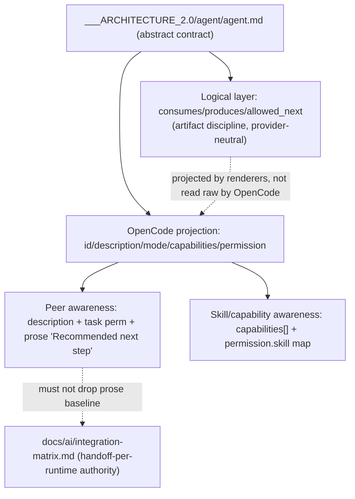

# Plan 1 — Align the abstract agent contract with OpenCode's real loader

- Status: Todo
- Owner: utmostcreator
- Branch: `fix/opencode-agent-body-parity`
- Risk: medium (docs/contract change; no runtime code path, but it governs how future
  agents are authored and could induce false-parity if done wrong)
- Source-of-truth files touched: `___ARCHITECTURE_2.0/agent/agent.md` (the abstract
  contract), `docs/ai/integration-matrix.md` (handoff-per-runtime authority),
  `docs/ai/adapter-contract.md` (provider-agnostic + handoff baseline rules)
- Verification command: `composer test` (focused: `--filter OpencodeAgentBodyParity`,
  `--filter AdapterRenderDrift`) + `php tools/ai/validate-adapter-drift.php`

## Problem (evidence-grounded)

The abstract agent contract at `___ARCHITECTURE_2.0/agent/agent.md` describes an
idealized artifact-passing orchestrator whose frontmatter and permission model do
**not** match how OpenCode actually discovers, wires, and isolates agents. Verified
against the OpenCode lifecycle model
(`___ARCHITECTURE_2.0/opencode_architecture/lifecycle-model/lifecycle/model/opencode.lifecycle.yaml`
@ `sst/opencode 9976269`) and two shipped OpenCode agents
(`.opencode/agents/researcher.md`, `.opencode/agents/architect.md`).

| # | Abstract contract says | OpenCode reality (evidence) | Impact |
|---|---|---|---|
| G1 | frontmatter `role:` / `contract:` / `runtime:` with `consumes`/`produces`/`allowed_next` | Real agents use `id`,`description`,`mode`,`hidden`,`temperature`,`capabilities`,`permission`,`agent_assessment`; discovery reads only these (`discovery.AGENTS`→`request_routing.REG`) | authored agent half-ignored by loader |
| G2 | `permission_profile:` + `.ai/permissions.yaml` | `.ai/permissions.yaml` ABSENT; zero `permission_profile` hits; real model is composed layers (`permission-layers/compose.php`) → inline `permission:` block | documents a permission system the repo does not use |
| G3 | `allowed_next:` frontmatter drives handoff | OpenCode has NO structured handoff; peer awareness is ONLY `AWARE` (subagent names+descriptions via `task.ts`) + `description:` + prose. `handoffs:` frontmatter is Copilot-only (`copilot-agent-handoff-registry.php`); `integration-matrix.md` mandates the prose "Recommended next step" sentence as the guaranteed baseline | handoff key is dead on OpenCode |
| G4 | static `## Loads → Skills` list | Skills load on demand via `permission.skill:` map; `SK_INDEX`+capability index+`REF_INDEX` injected per turn; real agents use `capabilities:` frontmatter (15/17) | skill/capability awareness channel omitted |
| G5 | `runtime.maximum_steps` implies a hard cap | `maxSteps` is advisory (tools still passed, `prompt.ts:1285`); subagents default-deny `todowrite`+`task` and inherit only `external_directory`+`deny` | wrong runtime mental model; missing isolation contract |

## Proposed design

Rewrite `___ARCHITECTURE_2.0/agent/agent.md` so its normative contract is expressed
in **OpenCode's real seams**, while keeping the good artifact-discipline content as a
*provider-neutral logical layer* clearly separated from the *OpenCode projection*. Do
not delete the artifact-progression model — relabel it as logical contract that
renderers project, mirroring the existing `adapter-contract.md` "canonical → registry
→ renderer → output" rule.

### Step-by-step (ordered)

1. **Add an explicit "OpenCode projection" section** to `agent.md` documenting the
   real frontmatter schema (`id`, `description`, `mode: subagent|all`, `hidden`,
   `temperature`, `capabilities: []`, `permission: {edit,bash,task,skill,...}`,
   `agent_assessment`). State that OpenCode's discovery reads only these.
2. **Reclassify `consumes`/`produces`/`allowed_next` as a logical contract layer**
   (not OpenCode frontmatter). Add one sentence: "OpenCode does not read these keys;
   they are a provider-neutral logical contract that renderers/prose project. On
   OpenCode they surface as `description`, the `task` permission, and the prose
   handoff sentence." Keep the artifact-progression diagram.
3. **Replace the `.ai/permissions.yaml` / `permission_profile` block** with the real
   model: inline `permission:` block composed from `permission-layers/`; reference
   `docs/ai/adapter-contract.md` "Permission Projection Seam". Remove the false
   `source: .ai/permissions.yaml` line.
4. **Rewrite the handoff/awareness section** to OpenCode's actual channels: (a)
   `description:` (indexed at discovery, this is how peers become visible via
   `AWARE`), (b) `task` permission gating delegation, (c) the mandatory prose
   "Recommended next step" sentence (cite `integration-matrix.md` "Handoff Mechanism
   Per Runtime" + `handoff-contract.md`). Explicitly note `handoffs:` frontmatter is
   Copilot-only and additive, never a replacement for the prose baseline.
5. **Add a "Skills, capabilities, references" awareness subsection**: `capabilities:`
   frontmatter is the load-order routing; skills load on demand via `permission.skill`;
   `SK_INDEX`/capability index/`REF_INDEX` are injected per turn. Point at the real
   `## Capability Loading` / `## Capability Routing` patterns in shipped agents.
6. **Correct the runtime section**: `maximum_steps` → note OpenCode `maxSteps` is
   advisory (tools still passed), not a hard tool cut-off. Add the subagent-isolation
   contract: fresh session, prompt-only (no parent history), inherits only
   `external_directory`+`deny`, default-denies `todowrite`+`task`.
7. **Keep `## Avoid`, `## Exit criteria`, `## Failure routing` largely intact** but
   fix `delegate to an agent outside allowed_next` → "delegate outside the `task`
   permission scope / documented handoff targets" so the rule maps to a real
   enforcement seam.

## Things to avoid (non-goals)

- Do NOT edit any shipped `.opencode/agents/*.md`, `.github/agents/*.agent.md`, or
  `.claude/agents/*.md` in this plan — this is the abstract contract only. Shipped
  agents are generated (`GENERATED — DO NOT EDIT`); changing them means changing
  `packages/ai-universal-rules/templates/core/agents/**` + re-render, which is a
  separate slice.
- Do NOT invent a `.ai/permissions.yaml` file to make the abstract contract "true" —
  the repo deliberately uses composed inline permissions. Fix the doc, not the model.
- Do NOT add `allowed_next:` or `consumes:`/`produces:` to any OpenCode frontmatter —
  the loader ignores them; that would be schema noise flagged by drift validation.
- Do NOT add `handoffs:` to OpenCode agents (Copilot-only surface) and never drop the
  prose "Recommended next step" sentence (false-parity regression per integration-matrix).
- Do NOT widen scope into the 7-agent OpenCode/Copilot count asymmetry (tracked
  separately) — keep this to the abstract contract's correctness.

## Acceptance criteria

Explicit:
- AC1 `agent.md` documents the real OpenCode frontmatter schema (`id`,`description`,
  `mode`,`hidden`,`temperature`,`capabilities`,`permission`,`agent_assessment`) and
  states discovery reads only these. (verify: read; grep the 8 keys present)
- AC2 The false `permission_profile` + `.ai/permissions.yaml` reference is removed and
  replaced with the composed-layer/inline-`permission` model citing
  `adapter-contract.md`. (verify: `grep -c 'permissions.yaml\|permission_profile' agent.md` == 0)
- AC3 Handoff section names all three real OpenCode awareness channels (`description`,
  `task` permission, prose "Recommended next step") and marks `handoffs:` Copilot-only
  additive. (verify: read)
- AC4 A skills/capabilities/references awareness subsection exists tying `capabilities:`
  frontmatter and `permission.skill` to on-demand loading. (verify: read)
- AC5 Runtime section corrects `maximum_steps` to advisory and adds the subagent
  isolation contract. (verify: read)

Evidence-backed:
- AC6 Every new OpenCode claim in `agent.md` cites either the lifecycle model node id
  (e.g. `subagent_isolation.SA_DENY`, `system_prompt_assembly.SP_SKILLS`) or a shipped
  file (`.opencode/agents/researcher.md`), matching the provenance discipline already
  used in the lifecycle YAML.

Negative (must not change):
- AC7 No file under `.opencode/agents/`, `.github/agents/`, `.claude/agents/`,
  `packages/ai-universal-rules/templates/**`, or `tools/ai/install/**` is modified by
  this plan. (verify: `git diff --name-only` shows only `agent.md` + this ticket)
- AC8 `php tools/ai/validate-adapter-drift.php` and the parity tests
  (`OpencodeAgentBodyParityTest`, `AdapterRenderDriftTest`) stay green (this change is
  outside their scanned surface; prove no regression).

## Verification plan

1. Focused: `git diff --name-only` confirms only 2 files changed (AC7).
2. `grep` assertions for AC1/AC2/AC3/AC4 keyword presence/absence.
3. `php tools/ai/validate-adapter-drift.php` — expect green, unchanged (AC8).
4. `composer test:fast` (or `--filter OpencodeAgentBodyParity --filter AdapterRenderDrift`)
   — expect green (AC8).
5. Manual read-through against the lifecycle model node ids for AC6 provenance.

## Risks / rollback

- Risk: over-correcting into false parity (adding OpenCode structured handoff). Mitigated
  by AC3/AC7 and the integration-matrix baseline rule.
- Risk: readers treat the abstract contract as the OpenCode schema. Mitigated by the
  explicit two-layer split (logical vs OpenCode projection).
- Rollback: single-doc revert (`git checkout -- ___ARCHITECTURE_2.0/agent/agent.md`);
  no runtime, generated, or permission artifact is touched, so rollback is trivial and
  has no blast radius.

## Recommended next step

Hand off to the `implementer` agent to apply steps 1–7 against
`___ARCHITECTURE_2.0/agent/agent.md` only, then run the AC7/AC8 verification.
`implementer means implementer agent handoff`. Reviewer recommended after implementation
because the change governs authoring policy: `reviewer means reviewer agent handoff`.
