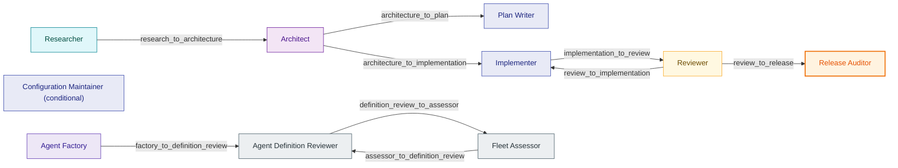
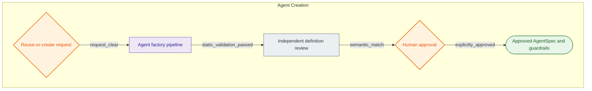
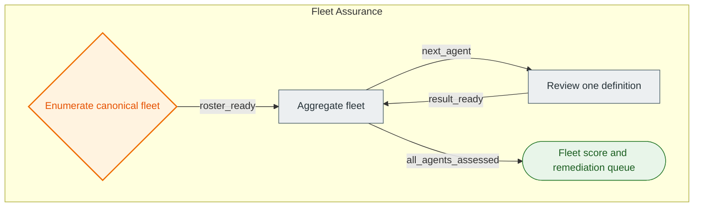
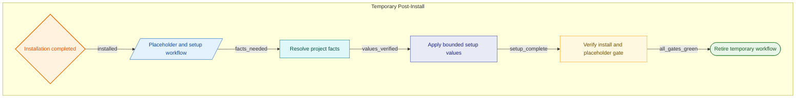

# Agent Handoff — Mermaid Diagrams

Generated from [`agent-handoff.yaml`](agent-handoff.yaml) via `handoff/gen_handoff.sh`.
Every block below is valid Mermaid — paste into any Mermaid renderer (mermaid.live,
GitHub, VS Code Mermaid preview, Obsidian, Notion).

---

## 1. Handoff interaction — who hands what to whom

Each edge is one handoff contract (`provide` / `produce` / `avoid` + safety fields
live in the YAML). `Configuration Maintainer` is a conditional role with no fixed
edge (it falls back to `Implementer`).

---

## 2. Combined — four workflow blocks + the two bridges

Workflows never hand off directly to each other; only the two dotted bridges
connect them. Edge labels are the routing guards.

```mermaid
flowchart LR
  classDef gate fill:#fff3e0,stroke:#ef6c00,color:#e65100,stroke-width:2px
  classDef terminal fill:#e8f5e9,stroke:#2e7d32,color:#1b5e20
  classDef research fill:#e0f7fa,stroke:#00838f,color:#004d40
  classDef design fill:#f3e5f5,stroke:#6a1b9a,color:#4a148c
  classDef write fill:#e8eaf6,stroke:#3949ab,color:#1a237e
  classDef review fill:#fff8e1,stroke:#f9a825,color:#6d4c00
  classDef factory fill:#ede7f6,stroke:#5e35b1,color:#311b92
  classDef audit fill:#eceff1,stroke:#455a64,color:#263238
  classDef skill fill:#e3f2fd,stroke:#1565c0,color:#0d47a1

  subgraph delivery["Change Delivery"]
    direction LR
    d_intake{"Task classification"}:::gate
    d_research["Researcher"]:::research
    d_design["Architect"]:::design
    d_plan["Plan Writer"]:::write
    d_impl["Implementer"]:::write
    d_review["Reviewer"]:::review
    d_release["Release Auditor"]:::gate
    d_done(["Accepted evidence"]):::terminal
    d_intake -->|evidence_missing| d_research
    d_intake -->|design_needed| d_design
    d_intake -->|bounded_low_risk| d_impl
    d_research -->|design_needed| d_design
    d_research -->|bounded_after_research| d_impl
    d_design -->|durable_plan_required| d_plan
    d_design -->|plan_not_required| d_impl
    d_plan -->|plan_accepted| d_impl
    d_impl -->|diff_ready| d_review
    d_review -->|findings_require_fix| d_impl
    d_review -->|release_relevant| d_release
    d_review -->|low_risk_pass| d_done
    d_release -->|ready| d_done
  end

  subgraph agent_creation["Agent Creation"]
    direction LR
    c_req{"Reuse-or-create request"}:::gate
    c_factory["Agent Factory"]:::factory
    c_review["Agent Definition Reviewer"]:::audit
    c_human{"Human approval"}:::gate
    c_ok(["Approved AgentSpec + guardrails"]):::terminal
    c_req -->|request_clear| c_factory
    c_factory -->|static_validation_passed| c_review
    c_review -->|semantic_match| c_human
    c_human -->|explicitly_approved| c_ok
  end

  subgraph fleet_assurance["Fleet Assurance"]
    direction LR
    f_enum{"Enumerate canonical fleet"}:::gate
    f_assess["Fleet Assessor"]:::audit
    f_critic["Agent Definition Reviewer"]:::audit
    f_report(["Fleet score + remediation queue"]):::terminal
    f_enum -->|roster_ready| f_assess
    f_assess -->|next_agent| f_critic
    f_critic -->|result_ready| f_assess
    f_assess -->|all_agents_assessed| f_report
  end

  subgraph post_install["Temporary Post-Install"]
    direction LR
    p_gate{"Installation completed"}:::gate
    p_skill[/"post-install-setup"/]:::skill
    p_evidence["Researcher"]:::research
    p_apply["Implementer"]:::write
    p_verify["Reviewer"]:::review
    p_retire(["Retire workflow"]):::terminal
    p_gate -->|installed| p_skill
    p_skill -->|facts_needed| p_evidence
    p_evidence -->|values_verified| p_apply
    p_apply -->|setup_complete| p_verify
    p_verify -->|all_gates_green| p_retire
  end

  c_ok -.->|approved_agent_to_fleet_assurance| f_enum
  d_done -.->|delivery_change_to_fleet_assurance| f_enum
```

---

## 3. Fleet migration — 24 current agents → targets

```mermaid
flowchart LR
  classDef removed fill:#ffebee,stroke:#c62828,color:#b71c1c
  classDef kept fill:#e8f5e9,stroke:#2e7d32,color:#1b5e20
  classDef skill fill:#e3f2fd,stroke:#1565c0,color:#0d47a1
  classDef research fill:#e0f7fa,stroke:#00838f,color:#004d40
  classDef write fill:#e8eaf6,stroke:#3949ab,color:#1a237e
  classDef review fill:#fff8e1,stroke:#f9a825,color:#6d4c00
  classDef design fill:#f3e5f5,stroke:#6a1b9a,color:#4a148c
  classDef gate fill:#fff3e0,stroke:#ef6c00,color:#e65100,stroke-width:2px
  classDef factory fill:#ede7f6,stroke:#5e35b1,color:#311b92
  classDef audit fill:#eceff1,stroke:#455a64,color:#263238

  cur_agent_creator_runtime_guardian["agent-creator-runtime-guardian"]:::removed --> |convert_to_skill| tgt_runtime_guardrail_design(["runtime-guardrail-design"]):::skill
  cur_agent_creator_semantic_verifier["agent-creator-semantic-verifier"]:::removed --> |convert_to_skill| tgt_agent_semantic_verification(["agent-semantic-verification"]):::skill
  cur_agent_creator_static_validator["agent-creator-static-validator"]:::removed --> |convert_to_deterministic_tool| tgt_agent_spec_validator(["agent-spec-validator"]):::skill
  cur_agent_creator_supervisor["agent-creator-supervisor"]:::removed --> |merge| tgt_agent_factory(["agent-factory"]):::factory
  cur_agent_creator["agent-creator"]:::removed --> |merge| tgt_agent_factory
  cur_agent_critic["agent-critic"]:::removed --> |rename| tgt_agent_definition_reviewer(["agent-definition-reviewer"]):::audit
  cur_agent_fleet_assessor["agent-fleet-assessor"]:::removed --> |rename| tgt_fleet_assessor(["fleet-assessor"]):::audit
  cur_architect["architect"]:::kept --> |keep| tgt_architect(["architect"]):::design
  cur_architecture_plan_writer["architecture-plan-writer"]:::removed --> |thin_and_rename| tgt_plan_writer(["plan-writer"]):::write
  cur_bugfix["bugfix"]:::removed --> |remove_agent_use_skill| tgt_impl_bugreg(["implementer+bug-regression"]):::write
  cur_build_config["build-config"]:::removed --> |merge_conditional| tgt_configuration_maintainer(["configuration-maintainer"]):::write
  cur_config_maintainer["config-maintainer"]:::removed --> |merge_conditional| tgt_configuration_maintainer
  cur_docs["docs"]:::removed --> |remove_agent_use_skill| tgt_impl_docs(["implementer+docs-sync"]):::write
  cur_implementer["implementer"]:::kept --> |keep| tgt_implementer(["implementer"]):::write
  cur_infra_auditor["infra-auditor"]:::removed --> |convert_to_reviewer_skill| tgt_rev_infra(["reviewer+infra-risk-audit"]):::review
  cur_post_install["post-install"]:::removed --> |convert_to_temporary_workflow| tgt_post_install_setup(["post-install-setup"]):::skill
  cur_refactorer["refactorer"]:::removed --> |remove_agent_use_skill| tgt_impl_refactor(["implementer+safe-refactor"]):::write
  cur_release_auditor["release-auditor"]:::kept --> |keep| tgt_release_auditor(["release-auditor"]):::gate
  cur_repository_researcher["repository-researcher"]:::removed --> |merge| tgt_researcher(["researcher"]):::research
  cur_researcher["researcher"]:::removed --> |merge| tgt_researcher
  cur_repository_reviewer["repository-reviewer"]:::removed --> |merge| tgt_reviewer(["reviewer"]):::review
  cur_reviewer["reviewer"]:::removed --> |merge| tgt_reviewer
  cur_upgrade["upgrade"]:::removed --> |remove_agent_use_skill| tgt_impl_dep(["implementer+dependency-upgrade"]):::write
  cur_workflow_auditor["workflow-auditor"]:::removed --> |convert_to_reviewer_skill| tgt_rev_wf(["reviewer+workflow-drift-audit"]):::review
```

---

## 4. Delivery workflow (detail)

```mermaid
flowchart LR
  classDef gate fill:#fff3e0,stroke:#ef6c00,color:#e65100,stroke-width:2px
  classDef terminal fill:#e8f5e9,stroke:#2e7d32,color:#1b5e20
  classDef research fill:#e0f7fa,stroke:#00838f,color:#004d40
  classDef design fill:#f3e5f5,stroke:#6a1b9a,color:#4a148c
  classDef write fill:#e8eaf6,stroke:#3949ab,color:#1a237e
  classDef review fill:#fff8e1,stroke:#f9a825,color:#6d4c00

  subgraph delivery["Change Delivery"]
    direction LR
    delivery__intake{"Task classification"}:::gate
    delivery__research["Research when evidence is insufficient"]:::research
    delivery__design["Design when contracts or risk are non-trivial"]:::design
    delivery__persist_plan["Persist durable plan when required"]:::write
    delivery__implement["Implement bounded slice"]:::write
    delivery__review["Independent review"]:::review
    delivery__release["Conditional release gate"]:::gate
    delivery__done(["Accepted evidence"]):::terminal
    delivery__intake -->|evidence_missing| delivery__research
    delivery__intake -->|design_needed| delivery__design
    delivery__intake -->|bounded_low_risk| delivery__implement
    delivery__research -->|design_needed| delivery__design
    delivery__research -->|bounded_after_research| delivery__implement
    delivery__design -->|durable_plan_required| delivery__persist_plan
    delivery__design -->|plan_not_required| delivery__implement
    delivery__persist_plan -->|plan_accepted| delivery__implement
    delivery__implement -->|diff_ready| delivery__review
    delivery__review -->|findings_require_fix| delivery__implement
    delivery__review -->|release_relevant| delivery__release
    delivery__review -->|low_risk_pass| delivery__done
    delivery__release -->|ready| delivery__done
  end
```

---

## 5. Agent Creation workflow (detail)

---

## 6. Fleet Assurance workflow (detail)

---

## 7. Temporary Post-Install workflow (detail)

